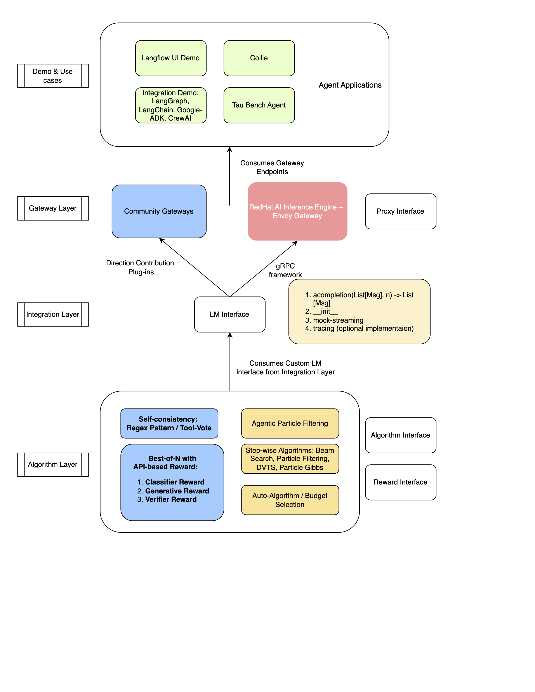

# ITS-Hub Interface Design Specification

## Document Purpose

This document defines the **interface contracts** for the its-hub library. It specifies the abstractions, method signatures, inputs/outputs, and functional requirements needed for implementation.

**Target Audience**: Software engineers implementing or integrating with its-hub
**Usage**: Implementation guide and review checklist for ensuring compliance with the architecture

---

## ITS-Hub Architecture Overview

**its-hub** is a lightweight library providing inference-time scaling (ITS) algorithms for improving LLM response quality. The architecture separates gateway integration from algorithm implementation, enabling algorithms to work with any AI gateway.



### Architecture Layers → Interface Design Mapping

| Layer | What It Is | Part of its-hub repo? | Where It Lives | Interface Section |
|-------|-----------|----------------------|----------------|-------------------|
| **Demo & Use Cases** (Top) | Agent applications (Langflow, LangChain, etc.) | ❌ No | External applications | Out of scope |
| **Gateway Layer** | AI Gateways (Portkey, LiteLLM, Envoy) | ❌ No | External systems | **Gateway Interface** |
| **Integration Layer** | Wraps gateway LM + Reward implementations | ❌ No | Gateway codebase (Direct PR) OR its-hub adapters (Plug-in) | **LM & Reward Interfaces** |
| **Algorithm Layer** | ITS algorithms (consume LM + Reward) | ✅ Yes | its-hub core | **Algorithm Interface** |

### What This Repository Contains

**its-hub core library provides**:
1. **Interface Definitions**: `AbstractLanguageModel`, `AbstractOutcomeRewardModel`, `AbstractScalingAlgorithm`
2. **Algorithm Implementations**: Self-Consistency, Best-of-N
3. **Default Helper**: `create_llm_judge()` - converts any LM into basic reward model

**Adapter Ecosystem** (separate packages):
- **its-hub-portkey**: Portkey gateway adapter (`pip install its-hub-portkey`)
- **its-hub-litellm**: LiteLLM gateway adapter (`pip install its-hub-litellm`)
- **its-hub-openai**: OpenAI-compatible adapter (`pip install its-hub-openai`)
- Each adapter package depends on: `its-hub` (core) + gateway-specific SDK

### Interface Definitions (Scope of its-hub)

This document defines **4 key interfaces** for inference-time scaling:

| Interface | Scope | Description |
|-----------|-------|-------------|
| **Gateway Interface** | ❌ External (out of scope) | Defines what external gateways must do (add before-request hook, check headers) |
| **LM Interface** | ✅ its-hub core | Wraps gateway LM to match `AbstractLanguageModel` contract |
| **Reward Interface** | ✅ its-hub core | Wraps gateway reward OR uses `create_llm_judge()` helper |
| **Algorithm Interface** | ✅ its-hub core | Consumes both LM and Reward interfaces to execute ITS strategies |

**its-hub Scope**: This library provides **interface contracts (LM, Reward, Algorithm)** as abstractions in the core library, preparing them for flexible integration with any gateway. Gateway teams implement these interfaces; its-hub provides the algorithm logic that consumes them.

**Design Principles**:
- **Minimal dependencies** (core: `numpy`, `typing-extensions`)
- **Gateway agnostic** (works with any gateway via standard interfaces)
- **Clear contracts** (well-defined interfaces enable independent implementation)
- **Algorithm first** (focus on reasoning, not infrastructure)

---

## Gateway Interface

### What is an AI Gateway?

An **AI Gateway** is the primary interface through which users access LLMs in production. It acts as an intelligent proxy layer between applications and model providers, offering critical enterprise capabilities:

**Core Gateway Capabilities:**

1. **Authentication & Authorization**: API key management, user authentication, access control
2. **Rate Limiting**: Request throttling, quota management per user/tenant
3. **Translation & Parameter Mapping**: Normalize requests across different model providers (OpenAI, Anthropic, AWS Bedrock, etc.)
4. **Load Balancing & Reliability**: Distribute load, automatic failover, retry logic
5. **Post-Processing & Observability**: Cost tracking, distributed tracing, usage analytics, audit logging

**Examples of AI Gateways:**
- **Portkey**: AI gateway with observability, caching, and 200+ LLM provider support
- **LiteLLM**: Open-source proxy supporting 100+ LLM providers with unified API
- **OpenRouter**: Multi-model gateway with routing and load balancing across providers

**Examples of General Gateways (extensible for AI):**
- **Envoy**: High-performance proxy/gateway (can be extended with AI-specific filters)
- **Kong**: API gateway with plugin system (can add AI capabilities)

### Why Integrate its-hub with Gateways?

**The Gateway is the Marketplace**: AI Gateways serve as the primary access point where users consume LLMs. They aggregate models from various vendors, hosters, and providers into a unified interface.

**Avoid Duplication**: Gateways already provide authentication, rate-limiting, load-balancing, tracing, and more. its-hub should NOT reimplement these capabilities. Instead, its-hub should be a **plug-in or feature** that gateways can enable.

**Seamless User Experience**: Users activate inference-time scaling (ITS) algorithms using the same interface they already use for model inference. No new APIs or workflow changes needed.

### Interface Contract

**Design Principle**: Minimal gateway changes. Activate ITS via HTTP headers checked by a before-request hook.

#### 1. Before-Request Hook (Required)

**Purpose**: Check for ITS activation headers and route accordingly

**Signature**:
```python
def before_request_hook(request: HTTPRequest) -> HTTPResponse:
    """
    Intercept requests and check for X-ITS-* headers.

    Returns:
        ITS response if headers present, else normal pass-through
    """
    if has_its_headers(request):
        return handle_its_request(request)
    else:
        return handle_normal_request(request)
```

#### 2. ITS Activation Headers

**Header Specification**:

| Header | Type | Required | Description |
|--------|------|----------|-------------|
| `X-ITS-Algorithm` | string | Yes | Algorithm: `"self-consistency"`, `"best-of-n"` |
| `X-ITS-Budget` | integer | Yes | Number of generations (computational budget) |
| `X-ITS-Projection-Regex` | string | No | Answer extraction regex (Self-Consistency) |
| `X-ITS-Tool-Vote` | string | No | Tool voting mode: `"tool_hierarchical"`, etc. |
| `X-ITS-Exclude-Args` | string | No | Comma-separated args to exclude from voting |
| `X-ITS-Judge-Model` | string | No | Judge model name (Best-of-N) |
| `X-ITS-Judge-Endpoint` | string | No | Judge model endpoint URL |
| `X-ITS-Judge-API-Key` | string | No | Judge model API key |

#### 3. Gateway Inference Endpoint (Already Exists)

**Requirement**: Gateway must have OpenAI-compatible `/v1/chat/completions` endpoint

**Required capabilities**:
- Support `n` parameter (n > 1) for multiple completions
- Support `temperature` parameter
- Handle concurrent requests

### Usage Example

```bash
# With ITS (Self-Consistency, budget=3)
curl -X POST https://gateway.example.com/v1/chat/completions \
  -H "Content-Type: application/json" \
  -H "X-ITS-Algorithm: self-consistency" \
  -H "X-ITS-Budget: 3" \
  -d '{
    "model": "gpt-4o-mini",
    "messages": [{"role": "user", "content": "What is 2+2?"}]
  }'

# Without ITS (normal pass-through)
curl -X POST https://gateway.example.com/v1/chat/completions \
  -H "Content-Type: application/json" \
  -d '{
    "model": "gpt-4o-mini",
    "messages": [{"role": "user", "content": "What is 2+2?"}]
  }'
```

**Response format**: Same as standard OpenAI response (with or without ITS)

---

## LM Interface (Integration Layer)

### Overview

**Purpose**: The LM Interface bridges gateway infrastructure to its-hub algorithms, enabling algorithms to work with any gateway implementation.

**What this layer does**:
- Provides a standard contract for language model access
- Decouples its-hub algorithms from gateway-specific implementations
- Enables "write once, run anywhere" for algorithms

**Key benefit**: Algorithm developers write against one interface; gateway developers implement once to support all algorithms.

**Defined in**: `its_hub/base.py` as `AbstractLanguageModel`

### Interface Contract

```python
from abc import ABC, abstractmethod
from typing import List, Dict, Any, Optional, Union

class AbstractLanguageModel(ABC):
    """
    Abstract interface for language model access.

    Gateway integrators implement this to enable its-hub algorithm support.
    """
```

#### Method 1: `__init__` (Constructor)

**Purpose**: Initialize connection to gateway's model serving infrastructure

**Signature**:
```python
def __init__(
    self,
    endpoint: str,                      # Gateway API endpoint
    api_key: str | None,                # Authentication (if required)
    model_name: str,                    # Model identifier
    temperature: float = 1.0,           # Default sampling temperature
    max_tokens: int | None = None,      # Default token limit
    timeout: int = 60,                  # Request timeout (seconds)
    max_concurrent_requests: int = 10,  # Concurrency limit
    **kwargs                            # Gateway-specific config
) -> None:
    """Initialize language model client."""
```

**Requirements**:
- Store configuration for `agenerate` calls
- Set up client for gateway communication (HTTP, gRPC, SDK, etc.)
- Configure concurrency control (its-hub algorithms make parallel requests)

#### Method 2: `agenerate` (Core Method - REQUIRED)

**Purpose**: Generate model completion(s) asynchronously

**Signature**:
```python
@abstractmethod
async def agenerate(
    self,
    messages: Union[List[ChatMessage], List[List[ChatMessage]]],
    stop: Optional[str] = None,
    **kwargs
) -> Union[Dict[str, Any], List[Dict[str, Any]]]:
    """
    Generate response(s) from the model.

    Args:
        messages: Single conversation or batch
            Single: [{"role": "user", "content": "..."}]
            Batch:  [[...], [...], ...]
        stop: Stop sequence
        **kwargs: temperature, max_tokens, n, tools, tool_choice, etc.

    Returns:
        Single: {"role": "assistant", "content": "...", "tool_calls": [...]}
        Batch:  [response1, response2, ...]
    """
```

**Output Specification**:

```python
{
    "role": "assistant",
    "content": str,                     # Generated text
    "tool_calls": List[dict] | None     # Tool calls if applicable
}
```

**Behavior Requirements**:
- **Batch detection**: Check if `isinstance(messages[0], list)` for batch mode
- **Concurrency control**: Respect `max_concurrent_requests` limit
- **Error handling**: Retry transient errors (rate limits, timeouts), fail fast on permanent errors (4xx)
- **Tool preservation**: If gateway returns tool_calls, include in output
- **Format normalization**: Return consistent format regardless of gateway's native format

### Type Definitions

```python
from typing import TypedDict, List, NotRequired

class ChatMessage(TypedDict):
    role: str                           # "system", "user", "assistant", "tool"
    content: str                        # Message content
    name: NotRequired[str]              # Optional: function name for tool messages
    tool_calls: NotRequired[List[dict]] # Optional: tool calls in assistant message
    tool_call_id: NotRequired[str]      # Optional: ID for tool response messages

ChatMessages = List[ChatMessage]
```

### Two Integration Approaches

Gateway teams have two options for implementing its-hub support:

#### Approach 1: Direct Implementation (Pull Request to Gateway)

**How**: Gateway team implements `AbstractLanguageModel` directly in their codebase

**Implementation**:
```python
# In gateway codebase: gateway/its_integration.py
from its_hub import AbstractLanguageModel

class GatewayLM(AbstractLanguageModel):
    def __init__(self, model_name, **kwargs):
        # Use gateway's existing LM client
        self.client = gateway.get_model_client(model_name)

    async def agenerate(self, messages, stop=None, **kwargs):
        # Call gateway's native inference method
        response = await self.client.inference(messages, **kwargs)
        return self._normalize_response(response)
```

**Pros**:
- Native integration with gateway infrastructure
- Full control over implementation
- Optimal performance (no extra layer)
- Can leverage gateway-specific optimizations

**Cons**:
- Gateway team owns maintenance
- Requires gateway code changes

**Best for**: Gateways that want deep integration and full control

---

#### Approach 2: Plug-in Library (Adapter Pattern)

**How**: Install separate adapter package; gateway imports and uses it

**Implementation**:
```python
# Installation
# pip install its-hub-portkey  (depends on: its-hub + portkey-sdk)

# In gateway codebase: gateway/plugins/its_plugin.py
from its_hub_portkey import PortkeyAdapter  # From separate package

class ITSPlugin:
    def __init__(self, gateway_config):
        # Adapter wraps gateway's existing client
        self.lm = PortkeyAdapter(
            client=gateway.client,
            model_name=gateway_config.default_model
        )

    async def handle_its_request(self, request):
        from its_hub import SelfConsistency, BestOfN
        # Use pre-built adapter with algorithms
        algorithm = self._get_algorithm(request.headers)
        return await algorithm.ainfer(self.lm, request.messages, request.budget)
```

**Adapter packages** (maintained separately):
```python
# its-hub-portkey package
class PortkeyAdapter(AbstractLanguageModel):
    """Pre-built adapter for Portkey gateway"""
    # Depends on: its-hub (core) + portkey-sdk

# its-hub-litellm package
class LiteLLMAdapter(AbstractLanguageModel):
    """Pre-built adapter for LiteLLM gateway"""
    # Depends on: its-hub (core) + litellm

# its-hub-openai package
class OpenAICompatibleAdapter(AbstractLanguageModel):
    """Pre-built adapter for OpenAI-compatible APIs"""
    # Depends on: its-hub (core) + openai
```

**Pros**:
- Zero implementation effort for gateway team
- Maintained by its-hub team (separate packages)
- Quick integration (install adapter package)
- Easy to upgrade (update adapter version)
- **Keeps core its-hub minimal** (no gateway-specific dependencies)

**Cons**:
- Extra dependency on adapter package
- Less customization
- May not leverage gateway-specific features

**Best for**: Gateways that want fast integration with minimal effort

---

### Comparison

| Aspect | Direct Implementation | Plug-in Library |
|--------|----------------------|-----------------|
| **Implementation Effort** | Gateway team implements | Import pre-built adapter |
| **Maintenance** | Gateway team | its-hub team |
| **Customization** | Full control | Limited |
| **Performance** | Optimal | Good (extra layer) |
| **Dependencies** | None (its-hub core only) | its-hub core + adapter package |
| **Integration Time** | Weeks | Days |
| **Best For** | Deep integration, full control | Fast integration, minimal effort |

### Usage Example

```python
from its_hub import AbstractLanguageModel, SelfConsistency

# Gateway implements the interface (either approach)
class MyGatewayLM(AbstractLanguageModel):
    def __init__(self, endpoint, api_key, model_name):
        self.client = gateway_sdk.Client(endpoint, api_key)
        self.model = model_name

    async def agenerate(self, messages, stop=None, **kwargs):
        response = await self.client.chat(
            model=self.model,
            messages=messages,
            **kwargs
        )
        return {"role": "assistant", "content": response.text}

# Use with its-hub algorithms
lm = MyGatewayLM("https://gateway.com", "key", "gpt-4o-mini")
algorithm = SelfConsistency()
result = await algorithm.ainfer(lm, "What is 2+2?", budget=5)
```

---

## Reward Interface (Integration Layer)

### Overview

**Purpose**: The Reward Interface defines how to score responses for quality/correctness selection. **Symmetric to LM Interface** - both are integration concerns.

**What this layer does**:
- Provides a standard contract for reward model access
- Decouples its-hub algorithms from reward-specific implementations
- Enables "write once, run anywhere" for algorithms

**Key benefit**: Algorithm developers write against one interface; integration provides implementations (gateway native OR its-hub helper).

**Defined in**: `its_hub/base.py` as `AbstractOutcomeRewardModel`

### Interface Contract

```python
from abc import ABC, abstractmethod
from typing import List, Dict, Any, Union, Optional

class AbstractOutcomeRewardModel(ABC):
    """
    Abstract interface for reward models that score complete responses.

    Integration Layer implements this by wrapping gateway reward services
    OR using its-hub's create_llm_judge() helper.
    """
```

#### Method 1: `__init__` (Constructor)

**Purpose**: Initialize reward model with configuration

**Signature**: Implementation-specific.

#### Method 2: `score` (Core Method - REQUIRED)

**Purpose**: Score response(s) or conversation(s)

**Signature**:
```python
@abstractmethod
def score(
    self,
    messages: Union[List[Dict], List[List[Dict]]],
    **kwargs
) -> Union[float, List[float]]:
    """
    Score conversation(s).

    Args:
        messages: Single conversation or batch
            Single: [{"role": "user", ...}, {"role": "assistant", ...}]
            Batch:  [[conv1], [conv2], ...]
        **kwargs: Model-specific parameters

    Returns:
        Single: float (score)
        Batch:  List[float] (one score per conversation)

    Note: Higher score = better response
    """
```

**Behavior Requirements**:
- **Batch detection**: Check if `isinstance(messages[0], list)`
- **Consistent scoring**: Scores must be comparable across responses
- **Higher is better**: Convention that higher scores indicate better quality

#### Method 3: `ascore` (Async Scoring - OPTIONAL)

**Purpose**: Asynchronous scoring for models that make async calls (e.g., LLM judges)

**Note**: Default implementation raises `NotImplementedError`. Only implement if scoring requires async operations.

### Two Integration Approaches

Integration Layer has two options for implementing reward model support (parallel to LM Interface):

#### Approach 1: Wrap Gateway Native Reward Service

**How**: Gateway has native scoring/reward service; Integration wraps it

**Implementation**:
```python
# In gateway codebase: gateway/its_integration.py
from its_hub import AbstractOutcomeRewardModel

class GatewayReward(AbstractOutcomeRewardModel):
    def __init__(self):
        # Use gateway's existing reward service
        self.scorer = gateway.get_reward_service()

    def score(self, messages, **kwargs):
        # Wrap gateway's native API
        result = self.scorer.evaluate(messages)
        return self._normalize_score(result)
```

**Examples of gateway native services**:
- Toxicity classifiers
- Quality scorers
- Safety filters
- Domain-specific validators

**Pros**:
- Leverages gateway's optimized infrastructure
- No dependency on LLM calls for scoring
- Potentially faster and cheaper

**Best for**: Gateways with existing reward/scoring services

---

#### Approach 2: Use its-hub Helper (LLM-Judge)

**How**: Integration uses `create_llm_judge()` helper from its-hub Algorithm Layer

**Implementation**:
```python
# In gateway codebase: gateway/its_integration.py
from its_hub import create_llm_judge

class ITSIntegration:
    def __init__(self, lm_wrapper):
        # No native reward service - use its-hub helper
        self.reward = create_llm_judge(
            lm=lm_wrapper,
            judge_prompt=None,      # Use default prompt
            fallback_score=5.0
        )
```

**its-hub provides**:
```python
# its_hub/algorithms/helpers.py (Algorithm Layer)
def create_llm_judge(
    lm: AbstractLanguageModel,
    judge_prompt: Optional[str] = None,
    fallback_score: float = 5.0
) -> AbstractOutcomeRewardModel:
    """
    Convenience helper: wrap any LM into basic LLM-judge reward model.

    Integration Layer can use this when gateway lacks native reward service.
    Gateway can also provide optimized LLMJudge implementation.
    """
```

**Pros**:
- Zero implementation effort
- Works immediately if LM Interface is implemented
- Good default for getting started

**Cons**:
- Requires LLM API calls (slower, more expensive)
- Basic implementation (no batching, caching, optimization)

**Best for**: Quick integration, gateways without native reward services

---

### Comparison

| Aspect | Gateway Native Reward | its-hub Helper (LLM-Judge) |
|--------|----------------------|---------------------------|
| **Implementation Effort** | Wrap existing service | Import and use helper |
| **Requires** | Gateway reward service | LM Interface only |
| **Performance** | Fast (native service) | Slower (LLM calls) |
| **Cost** | Lower (no LLM calls) | Higher (LLM inference) |
| **Optimization** | Gateway controls | Basic (can be overridden) |
| **Best For** | Gateways with reward services | Quick start, no native service |

### Override Pattern: Optimized LLM-Judge

Gateways can also provide **optimized LLM-judge implementations** to improve on the basic helper:

```python
# Gateway provides optimized LLMJudge (Integration Layer)
from its_hub import AbstractOutcomeRewardModel

class OptimizedLLMJudge(AbstractOutcomeRewardModel):
    def __init__(self, lm, judge_prompt=None, batch_size=32, cache_enabled=True):
        self.lm = lm
        self.prompt = judge_prompt
        self.batch_size = batch_size
        self.cache = {} if cache_enabled else None

    def score(self, messages, **kwargs):
        # Optimized implementation with:
        # - Batching for efficiency
        # - Caching for repeated queries
        # - Better error handling
        # - Custom prompt engineering
        ...
```

**Three-level pattern**:
1. **Basic**: `create_llm_judge(lm)` - works immediately
2. **Optimized**: Gateway's `OptimizedLLMJudge` - better performance
3. **Native**: Gateway's domain-specific reward service - best performance

### Usage Example

```python
from its_hub import AbstractOutcomeRewardModel, BestOfN

# Integration Layer wraps gateway reward (either approach)
class MyGatewayReward(AbstractOutcomeRewardModel):
    def __init__(self, gateway_service):
        self.service = gateway_service  # Native service or LLM-judge

    def score(self, messages, **kwargs):
        # Adapt to AbstractOutcomeRewardModel interface
        return self.service.evaluate(messages)

# Use with its-hub algorithms
reward = MyGatewayReward(gateway.reward_service)
bon = BestOfN(reward_model=reward)
result = await bon.ainfer(lm, "Write a sorting function", budget=10)
```

---

## Algorithm Interface (its-hub Core)

### Overview

**Purpose**: The Algorithm Interface defines how inference-time scaling algorithms are implemented and consumed.

**What this layer does**:
- Defines the contract for all ITS algorithms (Self-Consistency, Best-of-N, etc.)
- Specifies algorithm inputs (LM, Reward, prompt, budget) and outputs (selected response)
- Provides `create_llm_judge()` helper for immediate reward model usability
- Enables algorithm composability and testing

**Key benefit**: All algorithms follow the same interface → applications can swap algorithms without code changes. Algorithms consume both LM and Reward interfaces.

**Defined in**: `its_hub/base.py` as `AbstractScalingAlgorithm` and `AbstractScalingResult`

### Interface Contract

```python
from abc import ABC, abstractmethod
from typing import Union, List, Dict, Any, Optional

class AbstractScalingAlgorithm(ABC):
    """
    Abstract interface for inference-time scaling algorithms.

    All algorithms (Self-Consistency, Best-of-N, etc.) implement this.
    Algorithms consume both LM Interface and Reward Interface.
    """
```

#### Method 1: `__init__` (Constructor)

**Purpose**: Initialize algorithm with configuration

**Signature**: Algorithm-specific. Each algorithm defines its own configuration parameters.

**Examples**:
```python
# Self-Consistency (consumes LM only)
SelfConsistency(projection_fn=None, tool_vote=None, exclude_args=None)

# Best-of-N (consumes LM + Reward)
BestOfN(reward_model: AbstractOutcomeRewardModel)
```

#### Method 2: `ainfer` (Core Method - REQUIRED)

**Purpose**: Execute the algorithm with given LM and computational budget

**Signature**:
```python
@abstractmethod
async def ainfer(
    self,
    lm: AbstractLanguageModel,
    prompt_or_messages: Union[str, List[ChatMessage]],
    budget: int,
    return_response_only: bool = True,
    tools: Optional[List[Dict]] = None,
    tool_choice: Optional[Union[str, Dict]] = None,
) -> Union[Dict[str, Any], AbstractScalingResult]:
    """
    Run inference-time scaling algorithm.

    Args:
        lm: Language model (implements AbstractLanguageModel from LM Interface)
        prompt_or_messages: User input
            - str: "What is 2+2?"
            - List[ChatMessage]: [{"role": "user", "content": "..."}]
        budget: Computational budget (algorithm-specific interpretation)
        return_response_only:
            - True: return selected response dict
            - False: return full result with metadata
        tools: OpenAI-style tool definitions (optional)
        tool_choice: Tool selection strategy (optional)

    Returns:
        If return_response_only=True:
            {"role": "assistant", "content": "...", "tool_calls": [...]}
        If return_response_only=False:
            AbstractScalingResult instance
    """
```

**Budget Interpretation** (algorithm-specific):

| Algorithm | Budget Meaning |
|-----------|----------------|
| Self-Consistency | Number of parallel generations |
| Best-of-N | Number of parallel generations |

**Output Specification**:
```python
# Simple output (return_response_only=True)
{
    "role": "assistant",
    "content": str,
    "tool_calls": List[dict] | None
}
```

#### Method 3: `infer` (Synchronous Wrapper)

**Note**: Default implementation provided via `asyncio.run(self.ainfer(...))`. Algorithm implementations typically do not override this.

### Algorithm Result Interface

```python
class AbstractScalingResult(ABC):
    """
    Result object returned when return_response_only=False.
    """

    @property
    @abstractmethod
    def the_one(self) -> Dict[str, Any]:
        """
        The selected best response.

        Returns:
            {"role": "assistant", "content": "...", "tool_calls": [...]}
        """
        pass

    @property
    def candidates(self) -> List[Dict[str, Any]]:
        """All generated candidate responses."""
        return []

    @property
    def scores(self) -> Optional[List[float]]:
        """Scores for each candidate (if applicable)."""
        return None

    @property
    def metadata(self) -> Dict[str, Any]:
        """Algorithm-specific metadata."""
        return {}
```

### Critical Clarification: Orchestration vs Algorithm Logic

**IMPORTANT**: The Algorithm Interface defines WHAT the algorithm does (vote, score, select). The Integration Layer (LM & Reward Interfaces) handles HOW to execute it (parallel calls, concurrency, fan-out).

**Algorithm Interface Responsibility**:
- Define selection logic (e.g., vote on most common, select highest score)
- Specify budget interpretation
- Implement result construction
- Provide `create_llm_judge()` helper for immediate reward model access

**Integration Layer Responsibility** (LM & Reward Interfaces):
- Execute parallel LM calls (fan-out with `asyncio.gather`)
- Execute reward scoring (batching, caching)
- Manage concurrency limits (semaphores)
- Handle retries and error recovery
- Batch request optimization

**Example**:
```python
# Algorithm Interface - WHAT to do
class SelfConsistency:
    async def ainfer(self, lm, prompt, budget, ...):
        # Algorithm says: "I need N responses"
        responses = await self._get_responses(lm, prompt, budget)
        # Algorithm says: "Vote on most common"
        return self._vote(responses)

# LM Interface (Integration Layer) - HOW to do it
class AbstractLanguageModel:
    async def agenerate(self, messages, ...):
        # Integration handles parallel execution
        tasks = [self._generate_single(...) for _ in range(n)]
        responses = await asyncio.gather(*tasks)  # Fan-out happens here
        return responses
```

### Helper Function: `create_llm_judge()`

**Purpose**: Convenience helper that wraps any `AbstractLanguageModel` into `AbstractOutcomeRewardModel`

**Location**: Algorithm Layer (its-hub core)

**Signature**:
```python
def create_llm_judge(
    lm: AbstractLanguageModel,
    judge_prompt: Optional[str] = None,
    fallback_score: float = 5.0
) -> AbstractOutcomeRewardModel:
    """
    Wrap any LM into basic LLM-judge reward model.

    Enables immediate Best-of-N usage when Integration Layer implements LM Interface.
    Integration Layer can override with optimized implementations.

    Args:
        lm: Any AbstractLanguageModel implementation
        judge_prompt: Custom judging prompt (uses default if None)
        fallback_score: Score to use if parsing fails

    Returns:
        AbstractOutcomeRewardModel that uses LM for scoring
    """
```

**Usage Pattern**:
```python
from its_hub import create_llm_judge, BestOfN

# Integration provides LM
lm = MyGatewayLM(...)

# Algorithm Layer helper creates reward model
judge = create_llm_judge(lm)

# Now Best-of-N works immediately
bon = BestOfN(reward_model=judge)
result = await bon.ainfer(lm, prompt, budget=5)
```

### Officially Supported Algorithms

#### 1. Self-Consistency

**Purpose**: Generate N responses, vote on most common answer

**Constructor**:
```python
class SelfConsistency(AbstractScalingAlgorithm):
    def __init__(
        self,
        projection_fn: Optional[Callable] = None,
        tool_vote: Optional[str] = None,
        exclude_args: Optional[List[str]] = None
    ):
        """
        Args:
            projection_fn: Extract answer from response (e.g., regex)
            tool_vote: Voting mode for tool calls
                - "tool_name": vote on tool names
                - "tool_args": vote on arguments
                - "tool_hierarchical": vote on full structure
            exclude_args: Args to ignore in voting (e.g., ["timestamp", "id"])
        """
```

**Consumes**: LM Interface only

**Budget**: Number of parallel generations

**Selection Logic**: Vote on most common answer (majority wins)

**Usage**:
```python
from its_hub import SelfConsistency

sc = SelfConsistency()
result = await sc.ainfer(lm, "What is 2+2?", budget=5)
# Generates 5 responses, returns most common answer
```

#### 2. Best-of-N

**Purpose**: Generate N responses, select highest-scoring one

**Constructor**:
```python
class BestOfN(AbstractScalingAlgorithm):
    def __init__(self, reward_model: AbstractOutcomeRewardModel):
        """
        Args:
            reward_model: Scores responses (from Reward Interface)
                - Gateway native reward service (wrapped)
                - create_llm_judge(lm) helper
                - Custom implementation
        """
```

**Consumes**: LM Interface + Reward Interface

**Budget**: Number of parallel generations

**Selection Logic**: Score all responses, return highest-scoring

**Usage**:
```python
from its_hub import BestOfN, create_llm_judge

# Option 1: Use helper (quick start)
judge = create_llm_judge(lm)
bon = BestOfN(reward_model=judge)

# Option 2: Use gateway native reward (optimized)
reward = MyGatewayReward(gateway.reward_service)
bon = BestOfN(reward_model=reward)

result = await bon.ainfer(lm, "Write a sorting function", budget=10)
# Generates 10 responses, scores each, returns best
```

---

## Implementation Checklist

### For Gateway Developers (Gateway Interface)

Integrating its-hub with your gateway:

- [ ] Expose inference endpoint with `n` parameter support (n > 1)
- [ ] Support concurrent requests (recommend: 10+ parallel)
- [ ] Return structured errors with retryable/permanent distinction
- [ ] Support standard parameters: temperature, max_tokens, stop, tools
- [ ] (Optional) Support batch inference for efficiency
- [ ] (Optional) Provide tracing/logging hooks

### For LM Interface Implementers

Implementing `AbstractLanguageModel`:

- [ ] Implement `__init__` with standard parameters (endpoint, api_key, model_name)
- [ ] Implement `agenerate` method (REQUIRED)
  - [ ] Handle single conversation input
  - [ ] Handle batch conversation input
  - [ ] Preserve tool_calls in output
  - [ ] Implement retry logic for transient errors
  - [ ] Respect concurrency limits (orchestration responsibility)
- [ ] Use default `generate` method (sync wrapper)
- [ ] (Optional) Implement `mock_streaming` for testing
- [ ] (Optional) Implement tracing methods

### For Reward Interface Implementers

Implementing `AbstractOutcomeRewardModel`:

- [ ] Implement `__init__` with reward model config
- [ ] Implement `score` method (REQUIRED)
  - [ ] Handle single conversation input
  - [ ] Handle batch conversation input
  - [ ] Return consistent scores (higher = better)
  - [ ] Implement batching/caching if optimizing (orchestration responsibility)
- [ ] Implement `ascore` if model makes async calls (e.g., LLM judge)
- [ ] Document score range and interpretation
- [ ] **Quickstart option**: Use `create_llm_judge(lm)` helper instead of implementing

### For Algorithm Implementers

Implementing `AbstractScalingAlgorithm`:

- [ ] Implement `__init__` with algorithm-specific config
- [ ] Implement `ainfer` method (REQUIRED)
  - [ ] Normalize input (handle str and List[ChatMessage])
  - [ ] Validate budget > 0
  - [ ] Generate responses using LM interface (let Integration handle fan-out)
  - [ ] Implement selection logic (vote, score, etc.)
  - [ ] Support return_response_only flag
  - [ ] Handle tools/tool_choice parameters
- [ ] Use default `infer` method (sync wrapper)
- [ ] Document budget interpretation in docstring
- [ ] Implement `AbstractScalingResult` subclass if return_response_only=False

---

## Appendix: Complete Interface Summary

| Interface | Layer | Implementer | Consumer | Status |
|-----------|-------|-------------|----------|--------|
| **Gateway Interface** | Gateway Layer | Gateway developers | Integration Layer | Requirements only |
| **LM Interface** (`AbstractLanguageModel`) | Integration Layer | Wraps gateway LM | Algorithms | ✅ Defined |
| **Reward Interface** (`AbstractOutcomeRewardModel`) | Integration Layer | Wraps gateway reward OR uses helper | Algorithms (Best-of-N) | ✅ Defined |
| **Algorithm Interface** (`AbstractScalingAlgorithm`) | Algorithm Layer | its-hub core | End users | ✅ Defined |
| **Algorithm Result** (`AbstractScalingResult`) | Algorithm Layer | its-hub core | End users | ✅ Defined |
| **Helper** (`create_llm_judge()`) | Algorithm Layer | its-hub core | Integration Layer (quickstart) | ✅ Defined |

---

**Document Version**: 1.0
**Last Updated**: 2025-11-21
**Authors**: Red Hat AI Innovation Team
