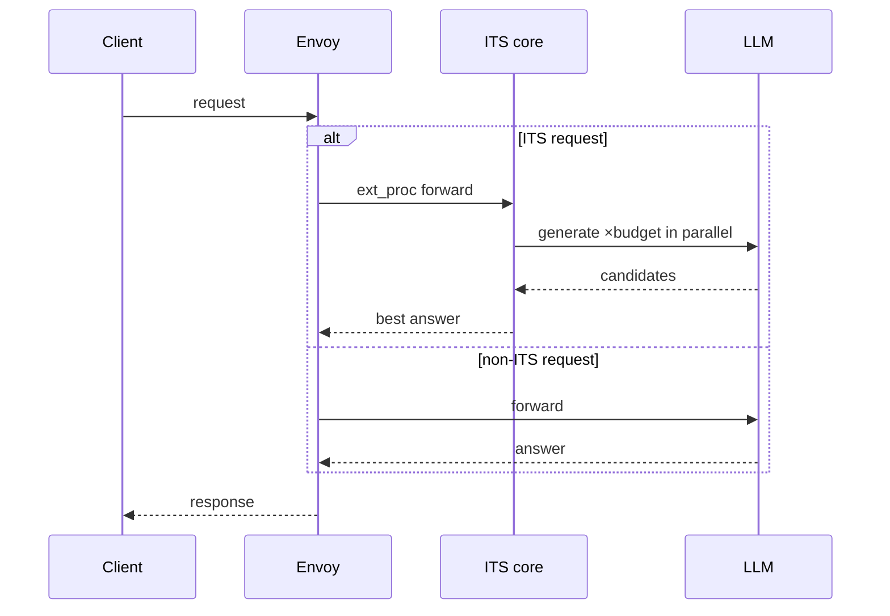
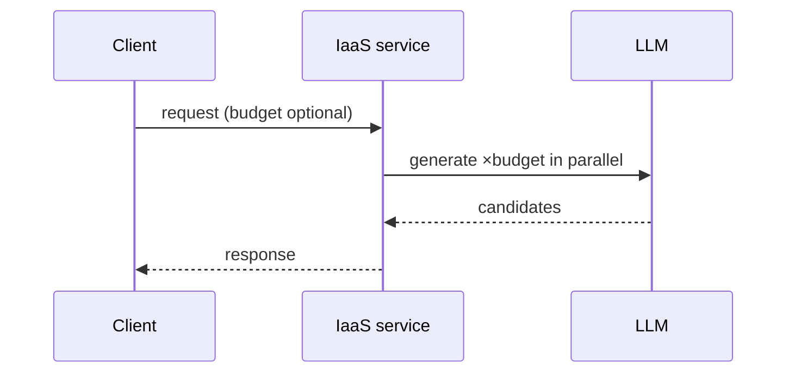

# Gateway Integration (Envoy)

A gateway sits between clients and an OpenAI-compatible endpoint. This guide adds inference-time
scaling (ITS) at that layer: rather than forwarding a chat-completion request to a single model call,
the gateway generates several candidates and returns the best one.

There are two approaches. **Approach 1 (ext_proc)** runs the ITS core as an Envoy external processor.
**Approach 2 (IaaS service)** runs it as a standalone OpenAI-compatible server, optionally behind
Envoy. The [Quickstart](#quickstart) gets each running; the [Overview](#overview) explains how they
work.

## Quickstart

### Approach 1 — ext_proc

Requires an [Envoy binary](https://www.envoyproxy.io/docs/envoy/latest/start/install). In the commands
below, open `envoy.yaml` and set `llm_upstream` to your LLM's address before you start Envoy.

```bash
pip install its_hub[ext_proc]
envoy-grpc --print-config > envoy.yaml   # bundled config; edit the llm_upstream address
envoy-grpc &                             # external processor (:50051) — its_hub/integration/ext_proc/server.py
envoy -c envoy.yaml                      # Envoy (:8108) — external Envoy binary
```

Send a request with `X-ITS-*` headers to scale it:

```bash
curl -X POST http://localhost:8108/v1/chat/completions \
  -H "Content-Type: application/json" \
  -H "X-ITS-Budget: 3" \
  -H "X-ITS-Endpoint: https://api.openai.com/v1" \
  -H "X-ITS-API-Key: $OPENAI_API_KEY" \
  -d '{"model": "gpt-4o-mini", "messages": [{"role": "user", "content": "What is 2+2?"}]}'
```

Requests without `X-ITS-*` headers pass through unchanged.

### Approach 2 — IaaS service

```bash
pip install its_hub[iaas]
its-iaas --port 8109                      # IaaS service (:8109) — its_hub/integration/iaas/app_server.py
```

Configure the upstream LLM once, then send standard OpenAI requests with a `budget` field:

```bash
curl -X POST http://localhost:8109/configure \
  -H "Content-Type: application/json" \
  -d '{"endpoint": "https://api.openai.com/v1", "api_key": "'"$OPENAI_API_KEY"'",
       "model": "gpt-4o-mini", "alg": "self-consistency",
       "regex_patterns": ["\\boxed\\{([^}]+)\\}"]}'

curl -X POST http://localhost:8109/v1/chat/completions \
  -H "Content-Type: application/json" \
  -d '{"model": "gpt-4o-mini",
       "messages": [{"role": "user", "content": "What is 2+2?"}],
       "budget": 4}'
```

For tool voting, the Python client, streaming, and production deployment, see the
[IaaS Service Guide](iaas-service.md).

#### Behind Envoy

To expose the IaaS service on the same `:8108` endpoint as Approach 1, place Envoy in front of it:

```bash
pip install its_hub[envoy-iaas]
its-iaas --print-config > envoy.yaml   # bundled config; edit the llm_upstream address
its-iaas-ext-proc --port 50051 &       # external processor / router (:50051) — its_hub/integration/iaas/grpc_server.py
its-iaas --port 8109 &                 # IaaS service (:8109) — its_hub/integration/iaas/app_server.py
envoy -c envoy.yaml                    # Envoy (:8108) — external Envoy binary
```

The client interface is identical to Approach 1: send requests to `:8108` with `X-ITS-*` headers.

## Overview

Both approaches share the **ITS core**, which takes a request and a budget, generates candidates, and
selects the best. The approaches differ only in where the core runs. In Approach 1, the core runs as
an Envoy external processor that Envoy calls over gRPC; in Approach 2, it runs inside a standalone
OpenAI-compatible server. Clients can call that server directly on its own port (`:8109`), or — as
shown in [Behind Envoy](#behind-envoy) — you can place Envoy in front of it so requests arrive on the
same `:8108` gateway endpoint as Approach 1.

### Approach 1 — ext_proc



Envoy's **ext_proc filter** forwards every request to an **external processor** (`:50051`) that runs
the ITS core. The **ITS core** shown in the diagram is that external processor: it parses the
`X-ITS-*` headers, fans out ×budget generations, and selects the best answer. A request carrying
`X-ITS-*` headers is fanned out: its candidates are generated and the best answer is returned directly.
All other requests pass through to the upstream LLM. An ITS failure therefore never causes a client
request to fail; the worst case is a single-sample response.

The ITS core is started by the `envoy-grpc` command. Despite its name, `envoy-grpc` does **not**
launch Envoy — Envoy is the separate `envoy -c envoy.yaml` process. `envoy-grpc` only starts the ITS
core that Envoy talks to over gRPC on `:50051`.

Internally, `server.py` runs the gRPC server and hands each request to a processor
(`processor.py`). The processor holds one ITS core object (`ITSGateway`) and, for an ITS request, just
calls it directly in Python — `await self.gateway.arun_chat_completion(...)` — then returns the best
answer to Envoy. So the only network hop is Envoy → the gRPC server; from there to the core is a plain
function call in the same process.

The `[ext_proc]` extra installs the ext_proc server and its gRPC dependencies (grpcio, grpcio-tools,
grpcio-health-checking, protobuf) and bundles the Envoy config at
`its_hub/integration/ext_proc/envoy_config.yaml`, which `envoy-grpc --print-config` writes out ready to
run — you only need to edit the `llm_upstream` address.

### Approach 2 — IaaS service



The **IaaS service** exposes the ITS core as a standalone OpenAI-compatible server (`:8109`); Envoy is
not required. Configure the upstream LLM once with `POST /configure`, then send standard OpenAI
requests. A `budget` field sets the number of parallel generations; if omitted, it defaults to 4.

#### Behind Envoy

To expose the IaaS service on the same `:8108` endpoint as Approach 1, place Envoy in front of it.
Envoy routes fan-out requests to the IaaS service and all others to the upstream LLM; the ITS core
runs inside the IaaS service. The `[envoy-iaas]` extra bundles both components.

The request flow is the same as the Approach 1 diagram above, with one difference in how the ITS
request reaches the core. Behind Envoy there's still a gRPC ext_proc, but it only makes a routing
decision — when it sees `X-ITS-Budget` it flips a header so Envoy forwards the request to the IaaS
service over plain HTTP. The ITS core runs inside that HTTP service, not in the ext_proc. In Approach 1,
by contrast, the ext_proc *is* the core. Everything else — the `X-ITS-*` branch, the ×budget fan-out,
and the pass-through fallback — is identical.

## Notes

- **Reading the diagrams.** The `alt` block marks the branch; each request follows exactly one path.
  Solid arrows are calls, dashed arrows are responses.
- **Per-request configuration.** In Approach 1, all parameters travel in `X-ITS-*` headers; no prior
  configuration is required. In Approach 2, the upstream LLM is configured once via `POST /configure`
  and each request supplies only its `budget` in the request body; `X-ITS-*` headers are also accepted
  as per-request overrides (header > body > `/configure` default).
- **Ports.** The values shown (`:8108`, `:50051`, `:8109`, `:8100`) are defaults and may be changed.
