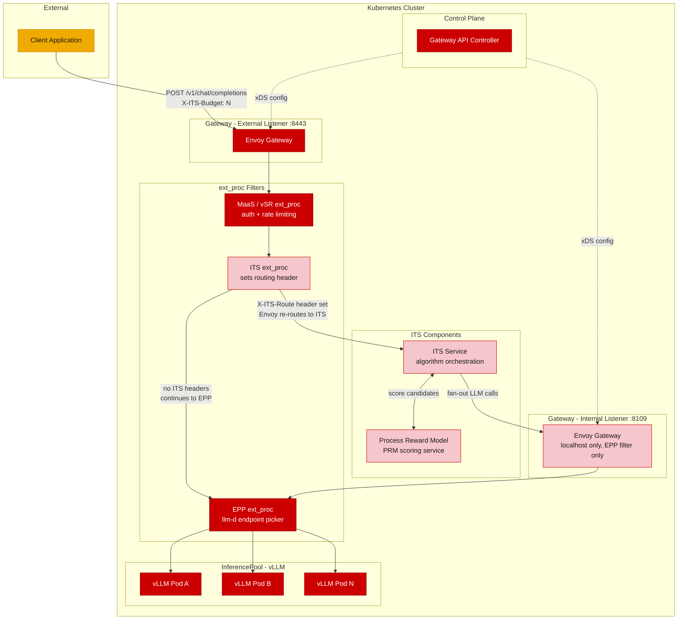
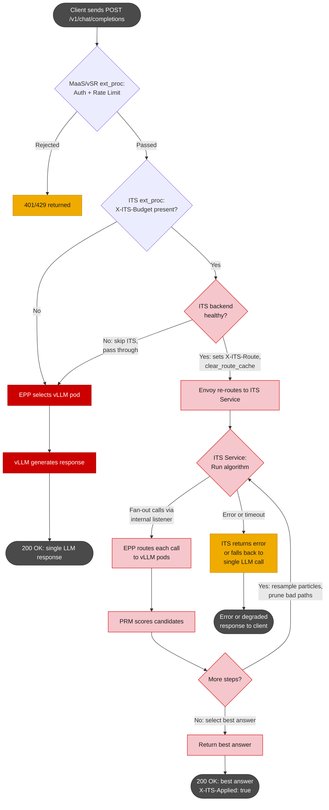

# ITS Gateway Integration

## What is inference-time scaling?

LLMs are stochastic. Ask the same math question five times and you'll get different quality answers each time. Inference-Time Scaling (ITS), also called test-time scaling, trades compute for accuracy: generate multiple candidates, score them with a reward model, drop the bad reasoning paths, return the best answer.

Google DeepMind's Paper showed that scaling compute at inference time can outperform scaling model parameters [1]. Our team's work on particle-based Monte Carlo methods demonstrated that a 1.5B model with ITS can beat GPT-4o accuracy in just 4 rollouts [2]. NVIDIA has noted that test-time scaling can enable reasoning[3].

This document describes how we integrate ITS into the Envoy-based LLM gateway. The goal: a client adds one header (`X-ITS-Budget: 8`) to a standard `/v1/chat/completions` request and gets back a better answer. No SDK, no scaffolding code, no client-side changes.

## Why do this at the gateway?

Using ITS today means importing the `its_hub` library, wiring up models and reward models, handling retries and failures. Every team repeats this work.

Using Gateway to intercept standard OpenAI-compatible chat completion requests, every existing tool, agent, and application works without modification.

## Target use cases

- **Critical tasks where correctness matters more than latency**: math, code generation, multi-step planning, compliance analysis.
- **Smaller models on limited GPU budgets**: a 7B model with ITS can close the accuracy gap with much larger models, which changes the cost equation.
- **Batch and async workloads** where a few extra seconds don't matter: report generation, document summarization, automated code review.

## Architecture

### Options considered

We looked at multiple approaches. Golang filters and WASM filters were ruled out early (Golang panics crash the entire Envoy process; WASM's `httpCall()` is sequential and can't do concurrent fan-out) and native C++ filter has high maintenance implications. The three viable options:

| Aspect | Option 1: ext_proc with `immediate_response` (Current PoC code) | Option 2: ext_proc routing + ITS backend (proposed) | Option 3: Gateway API native routing |
|--------|----------------------------------------------|--------------------------------------------------------|--------------------------------------|
| **How it works** | ext_proc buffers the request, runs the full ITS algorithm, returns `immediate_response` to short-circuit the filter chain | Lightweight ext_proc sets a routing header + `clear_route_cache`; Envoy routes to a dedicated ITS HTTP service | HTTPRoute with header matching routes ITS requests to the ITS service; no ext_proc needed |
| **Fan-out mechanism** | ext_proc makes HTTP calls via `aiohttp`, bypassing Envoy | ITS service sends fan-out through an internal Envoy listener where EPP does KV-cache-aware routing | Same as Option 2 |
| **Failure isolation** | Poor. gRPC stream held open 10-60s+; crash affects Envoy worker thread | Good. ITS is a normal upstream; crash returns 502 | Good. Same as Option 2 |
| **Fallback on failure** | `immediate_response` is terminal. No fallback mid-execution | Standard HTTP error handling. Envoy can circuit-break | Same as Option 2 |
| **Scaling** | Tied to ext_proc concurrency limits | Independent pod scaling | Same as Option 2 |
| **Observability** | Buried in ext_proc stats | Standard Envoy upstream metrics, access logs, tracing | Same as Option 2 |
| **Timeout model** | Must tune `message_timeout` for worst-case ITS execution | Standard route timeout (e.g., 300s) | Same as Option 2 |
| **Implementation** | Current PoC (`ext_proc/processor.py`) | ITS service already exists (`iaas.py`); needs routing config | Requires HTTPRoute header match rules |
| **Best for** | Prototyping | Production | Environments fully on Gateway API |

**We're going with Option 2.** The ext_proc handles the routing decision in microseconds. A separate ITS backend service handles the actual algorithm. This keeps the ext_proc lightweight, gives us crash isolation and independent scaling, and reuses the existing `iaas.py` service.

Option 3 works too, and the barrier is lower than it sounds (HTTPRoute header matching has been GA since Gateway API v1.0). Use it when Gateway API is the primary control plane and you don't want an ext_proc in the mix.

### How we route to the ITS service

The ext_proc needs to tell Envoy "send this request to the ITS service instead of the LLM." There are three ways to do this with `clear_route_cache`:

| Aspect | `:authority` mutation | `cluster_header` | Custom header match (recommended) |
|--------|----------------------|-------------------|-----------------------------------|
| **What ext_proc does** | Rewrites `:authority` to match ITS virtual host | Sets a header whose value is the target cluster name | Sets `X-ITS-Route: its-service` (TBD); route table matches on it |
| **Envoy support** | Supported, but high privillige `allow_all_routing: true` | Needs `cluster_header` in route config | Standard header match, works everywhere |
| **Readability** | Confusing. `:authority` no longer reflects the real destination | Cluster names are Envoy internals; fragile with control planes | Self-documenting. Header and route match are obvious |
| **Debugging** | Hard to trace | Moderate | Easy. `X-ITS-Route` shows up in access logs |

**We use custom header matching.** The ext_proc sets `X-ITS-Route: its-service` and calls `clear_route_cache`. Envoy re-evaluates the route table, matches the header, and sends the request to the ITS service cluster. Simple to debug, works with both raw Envoy config and Gateway API.

**ext_proc routing logic (pseudocode):**

```python
# Header phase only. No body inspection, no buffering.

if "x-its-budget" in request_headers and its_backend_is_healthy():
    response = HeadersResponse(
        header_mutation=HeaderMutation(
            set_headers=[Header(key="X-ITS-Route", value="its-service")]
        ),
        clear_route_cache=True,
        status=CONTINUE,
    )
else:
    # No ITS header, or ITS backend unhealthy -- pass through to LLM via EPP
    response = HeadersResponse(status=CONTINUE)
```

### New components

Three things get added:

**ITS ext_proc** checks two things: is `X-ITS-Budget` present, and is the ITS backend service healthy. If both pass, it injects `X-ITS-Route` and calls `clear_route_cache`. If the backend is unhealthy, it skips the header injection and returns `CONTINUE`, so the request goes through EPP to the LLM normally. No buffering, no body inspection, no algorithm execution. Completes in microseconds. Configured with `failure_mode_allow: true` so requests also pass through if the ext_proc itself is down.

**ITS Service** is an HTTP service that receives the chat completion request, runs the ITS algorithm, and returns a single OpenAI-compatible response. It fans out LLM calls through the internal gateway, coordinates with the PRM for scoring, and handles resampling and selection. The current prototype uses FastAPI (`iaas.py`); the production implementation will use a higher-performance server. Deployed as a Kubernetes Deployment with its own autoscaler.

The `X-ITS-Budget` header maps to the `budget` parameter: for self-consistency and best-of-N, it's the number of parallel candidates; for particle filtering and beam search, it's the number of particles/beams across sequential steps.

**Internal Gateway** is a second Envoy listener (or Gateway resource) bound to localhost, with EPP as the only filter. The ITS service sends fan-out calls here so each one gets KV-cache-aware routing to vLLM pods. No auth, no ITS filter, no rate limiting on this listener. It shares the same EPP cluster connection as the external listener; you don't need a second EPP deployment.

This internal gateway is not ITS-specific. Any in-cluster service that needs intelligent LLM routing without re-authenticating can use the same listener: RAG pipelines making retrieval-augmented calls, agent frameworks issuing tool-use follow-ups, evaluation harnesses running batch inference, or PRM scoring services that themselves call an LLM. The internal gateway is a shared piece of infrastructure for trusted internal inference traffic.

### Architecture diagram



**Color key:** Dark red = existing components. Light red = new ITS components. Orange = external.

> Note that The arrows from `its_extproc` show the logical routing outcome. The ext_proc doesn't route directly. It sets a header and calls `clear_route_cache`; Envoy's route table does the actual routing.

### Request flow



Fallback on ITS failure is not automatic. The ITS service has to explicitly catch errors and either return a 502 or proxy the original request through the internal listener as a single LLM call. Envoy's circuit breaker on the ITS upstream can also help here.

The resample loop in the diagram applies to particle filtering and beam search. Self-consistency and best-of-N skip it; they fan out N calls, collect all responses, and pick the winner in one pass.

## Failure modes

| Scenario | What happens |
|----------|-------------|
| ITS ext_proc is down | `failure_mode_allow: true`. Routing header never gets set, request goes to EPP and LLM normally. Client gets a standard response. No error. |
| ITS backend is unhealthy | ext_proc detects unhealthy backend, skips header injection, returns `CONTINUE`. Request goes through EPP to LLM normally. Client gets a standard response. No error. |
| ITS service returns error | Envoy returns 502. Circuit breaker can be configured to skip ITS for subsequent requests. |
| Algorithm fails mid-execution | ITS service returns 500 or falls back to a single LLM call internally. Client sees either an error or a non-ITS response. |
| PRM is down | Scoring fails, algorithm can't proceed. ITS service returns error. PRM needs its own health checks. |
| Slow fan-out call | All particles in a step fan out in parallel; the step finishes when the slowest one returns. Per-call timeouts can drop slow particles. |

## Future considerations

**vLLM's `n` parameter.** vLLM supports `n` (number of output sequences) and `best_of` in its [sampling parameters](https://docs.vllm.ai/en/latest/api/vllm/sampling_params/). If llm-d exposed the `n` parameter through EPP, self-consistency could send one request with `n=budget` instead of N separate fan-out calls. That eliminates KV cache duplication across particles and cuts prefill compute by up to `budget`x. Needs coordination with the llm-d team on how `n>1` interacts with KV-cache scheduling and prefix caching.

**Streaming.** ITS buffers all candidates internally for scoring, so streaming partial results during the algorithm doesn't make sense. But once the best answer is selected, the final response can be streamed via SSE. Buffer internally, stream the answer.

**KV-cache affinity for cloned particles.** When particle filtering clones a high-scoring particle, the clone shares the same prefix as the original. If EPP routes the clone to a different pod, it has to re-prefill from scratch. A "prefix affinity" hint to EPP would keep clones on the same pod. Requires EPP routing logic changes.

**Algorithm selection header (`X-ITS-Algorithm`).** Self-consistency needs `budget` LLM calls. Particle filtering needs `budget x max_steps`. Exposing algorithm selection per-request enables better capacity planning and per-algorithm budget caps.

**Native C++ filter.** Envoy's MCP router (v1.37+) shows that in-process fan-out with `AsyncClient` and `MultiStream` works. If ITS adoption grows enough to justify the investment, a native filter would eliminate the network hop to the ITS backend and plug directly into Envoy's connection pool. That's a lot of C++ to write and maintain, though.

## References

1. Snell et al. (Google/DeepMind), "Scaling LLM Test-Time Compute Optimally," ICLR 2025. [arXiv:2408.03314](https://arxiv.org/abs/2408.03314)
2. Puri, Sudalairaj, Xu, Xu, Srivastava (Red Hat AI), "Rollout Roulette: Particle-Based Monte Carlo Methods for ITS." [arXiv:2502.01618](https://arxiv.org/abs/2502.01618)
3. NVIDIA, "AI Scaling Laws." [Blog post](https://blogs.nvidia.com/blog/ai-scaling-laws/)