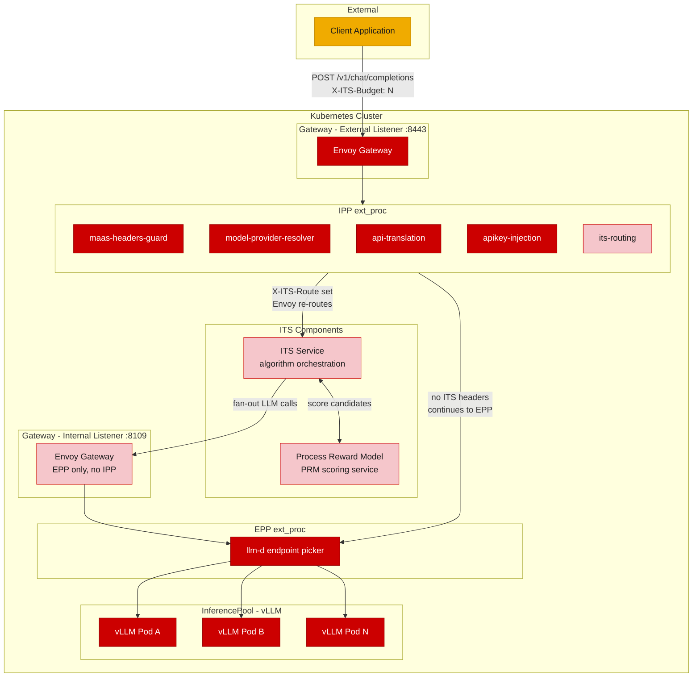
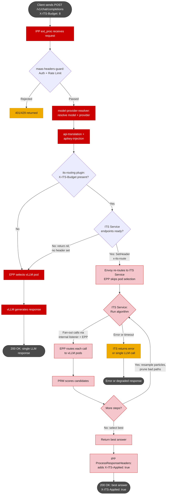

# ITS Integration via Inference Payload Processor (IPP)

## Overview

This document describes how to integrate inference-time scaling (ITS) into the LLM gateway as a **plugin** inside the [llm-d Inference Payload Processor](https://github.com/llm-d/llm-d-inference-payload-processor) (IPP), using the [ai-gateway-payload-processing](https://github.com/opendatahub-io/ai-gateway-payload-processing) plugin framework.

For background on what ITS is and why it belongs at the gateway, see [its-gateway-integration.md](its-gateway-integration.md). This document focuses on the integration method, not the motivation.

### Integration methods compared

There are three ways to add ITS to the gateway. This doc covers method 3.

| | Method 1: Standalone ext_proc (fanout in ext_proc) | Method 2: Standalone ext_proc (fanout in IaaS) | Method 3: IPP plugin (this doc) |
|---|---|---|---|
| **Where ITS routing lives** | Separate gRPC ext_proc process (Python) | Separate gRPC ext_proc process (Python) | Plugin inside IPP (Go) |
| **Where fanout lives** | In the ext_proc via `immediate_response` | In a separate ITS Service (IaaS) | In a separate ITS Service (IaaS) |
| **Deployment units** | ITS ext_proc + vLLM | ITS ext_proc + ITS Service + vLLM | IPP (with ITS plugin compiled in) + ITS Service + vLLM |
| **Filter chain** | MaaS ext_proc -> ITS ext_proc -> EPP | MaaS ext_proc -> ITS ext_proc -> EPP | IPP (MaaS + ITS + others as plugins) -> EPP |
| **Failure domain** | ITS ext_proc is isolated; crash doesn't affect auth/routing | Same | ITS plugin shares process with auth, model resolution, etc. |
| **Body parsing overhead** | Header-only, no body parsing | Header-only, no body parsing | Body parsed by IPP for other plugins; ITS pays shared cost but gains body access |
| **Language** | Python | Python | Go (plugin) + Python (ITS Service) |
| **Reference** | [PR #250](https://github.com/Red-Hat-AI-Innovation-Team/its_hub/pull/250) | [its-gateway-integration.md](its-gateway-integration.md) | This document |

Method 3 reduces the number of ext_proc processes in the filter chain and puts ITS routing alongside related concerns (auth, model resolution, API translation) in a single pipeline. The tradeoff is a shared failure domain and a Go implementation requirement for the routing plugin.

## IPP plugin framework

The IPP is a gRPC ext_proc server built on the llm-d framework. It runs plugins in a configurable pipeline to process requests and responses. Plugins are Go types that implement one or more interfaces:

- **`RequestProcessor`**: mutate request headers and body before Envoy routes the request
- **`ResponseProcessor`**: process the complete buffered response body
- **`ResponseHeadersProcessor`**: process response headers (works for both streaming and non-streaming)
- **`ResponseChunkProcessor`**: process individual streamed response chunks

Plugins communicate within a single request via **CycleState**, a per-request key-value store. Plugin A writes data during request processing; Plugin B reads it during request or response processing.

The IPP configuration defines:
- **Plugins**: typed instances with optional parameters
- **Profiles**: named pipelines of request and response plugins
- **ProfilePicker**: a plugin that selects which profile to run based on request properties
- **PreProcessors / PostProcessors**: plugins that run for all requests regardless of profile

The framework always sets `ClearRouteCache: true` after request processing, so any header mutation by any plugin triggers Envoy route re-evaluation.

## ITS plugin design

The ITS routing plugin is a single Go type implementing two interfaces: `RequestProcessor` (for routing) and `ResponseHeadersProcessor` (for tagging responses). It does not execute any ITS algorithm -- it only decides whether to route to the ITS Service.

### Request processing

During `ProcessRequest`, the plugin:

1. Checks if `X-ITS-Budget` header is present in the request
2. If absent, returns nil (request continues to LLM via EPP)
3. If present, checks whether the ITS Service has healthy endpoints (via a K8s Endpoints reconciler)
4. If unhealthy, returns nil (graceful fallback to direct LLM)
5. If healthy, calls `request.SetHeader("X-ITS-Route", "its-service")` and writes an ITS-routed flag to CycleState
6. Returns nil (the framework applies the header mutation and `ClearRouteCache` automatically)

The plugin never returns an error for routing decisions. Returning an error would cause the framework to send an immediate error response and terminate the request. Graceful fallback means returning nil and not setting the routing header.

```go
func (p *ITSRoutingPlugin) ProcessRequest(ctx context.Context, cycleState *plugin.CycleState, request *requesthandling.InferenceRequest) error {
    budget := request.Headers["x-its-budget"]
    if budget == "" {
        return nil
    }

    if !p.itsEndpointsReady() {
        log.FromContext(ctx).Info("ITS backend unhealthy, falling back to direct LLM")
        return nil
    }

    request.SetHeader("x-its-route", "its-service")
    request.RemoveHeader("x-its-budget")
    cycleState.Write("its-routed", true)

    log.FromContext(ctx).Info("routing to ITS service", "budget", budget)
    return nil
}
```

### Response header processing

During `ProcessResponseHeaders`, the plugin checks CycleState for the ITS-routed flag and adds a response header:

```go
func (p *ITSRoutingPlugin) ProcessResponseHeaders(ctx context.Context, cycleState *plugin.CycleState, response *requesthandling.InferenceResponse) error {
    routed, err := plugin.ReadCycleStateKey[bool](cycleState, "its-routed")
    if err != nil || !routed {
        return nil
    }
    response.SetHeader("x-its-applied", "true")
    return nil
}
```

### Health checking via K8s Endpoints

The plugin watches the ITS Service's Endpoints object using the framework's `ReconcilerBuilder()` and `Client()`. When ITS backend pods come and go, the reconciler updates an in-memory readiness flag. This is reactive (no polling) and consistent with how other IPP plugins (e.g., `model-provider-resolver`) watch K8s resources.

```go
func NewITSRoutingPlugin(reconcilerBuilder func() *builder.Builder, k8sClient client.Client, cfg *ITSConfig) (*ITSRoutingPlugin, error) {
    plugin := &ITSRoutingPlugin{
        typedName: plugin.TypedName{Type: ITSRoutingPluginType, Name: ITSRoutingPluginType},
        ready:     &atomic.Bool{},
    }

    reconciler := &itsEndpointReconciler{
        Reader:    k8sClient,
        ready:     plugin.ready,
        namespace: cfg.Namespace,
        name:      cfg.ServiceName,
    }

    if err := reconcilerBuilder().
        For(&corev1.Endpoints{}).
        Complete(reconciler); err != nil {
        return nil, fmt.Errorf("failed to register Endpoints reconciler: %w", err)
    }

    return plugin, nil
}
```

If all ITS backend pods are down, the reconciler sets `ready` to false. The next request with `X-ITS-Budget` sees the unhealthy state and falls back to direct LLM routing. There is no window where the plugin sets the routing header for a dead backend -- the reconciler reacts to Endpoints changes before new requests arrive.

### Factory and registration

The plugin follows the standard IPP factory pattern:

```go
const ITSRoutingPluginType = "its-routing"

func ITSRoutingFactory(name string, parameters json.RawMessage, handle plugin.Handle) (plugin.Plugin, error) {
    var cfg ITSConfig
    if err := json.Unmarshal(parameters, &cfg); err != nil {
        return nil, fmt.Errorf("failed to parse its-routing parameters: %w", err)
    }

    p, err := NewITSRoutingPlugin(handle.ReconcilerBuilder, handle.Client(), &cfg)
    if err != nil {
        return nil, err
    }
    return p.WithName(name), nil
}
```

Registration in `ai-gateway-payload-processing/pkg/plugins/plugins.go`:

```go
import its_routing "github.com/opendatahub-io/ai-gateway-payload-processing/pkg/plugins/its-routing"

func RegisterPlugins() {
    // ... existing plugins ...
    plugin.Register(its_routing.ITSRoutingPluginType, its_routing.ITSRoutingFactory)
}
```

### Plugin configuration

The factory receives parameters as `json.RawMessage`. The ITS plugin config:

```go
type ITSConfig struct {
    // ServiceName is the K8s Service name for the ITS backend.
    ServiceName string `json:"serviceName"`

    // Namespace is the K8s namespace where the ITS Service runs.
    Namespace string `json:"namespace"`

    // RoutingHeaderValue is the value set on the X-ITS-Route header.
    // Must match the Envoy route table's header match rule.
    RoutingHeaderValue string `json:"routingHeaderValue"`
}
```

### CycleState keys

| Key | Written by | Read by | Type | Purpose |
|-----|-----------|---------|------|---------|
| `its-routed` | `ProcessRequest` | `ProcessResponseHeaders` | `bool` | Flags that this request was routed to ITS, so the response gets `X-ITS-Applied` |

The ITS plugin can optionally read CycleState keys written by upstream plugins (e.g., `state.ModelKey` from `model-provider-resolver`) to make model-specific routing decisions in the future. This is not required for the initial implementation.

## IPP configuration

The IPP uses a Kubernetes-style YAML configuration (`PayloadProcessorConfig`). Below is an example showing where the ITS plugin fits.

### External listener configuration

```yaml
apiVersion: config.llm-d.ai/v1alpha1
kind: PayloadProcessorConfig
plugins:
  - name: maas-headers-guard
    type: maas-headers-guard
  - name: model-provider-resolver
    type: model-provider-resolver
  - name: api-translation
    type: api-translation
  - name: apikey-injection
    type: apikey-injection
  - name: its-routing
    type: its-routing
    parameters:
      serviceName: "its-service"
      namespace: "default"
      routingHeaderValue: "its-service"
  - name: profile-picker
    type: header-profile-picker

profilePicker:
  pluginRef: profile-picker

profiles:
  - name: default
    plugins:
      request:
        - pluginRef: model-provider-resolver
        - pluginRef: api-translation
        - pluginRef: apikey-injection
        - pluginRef: its-routing          # last request plugin

postProcessing:
  plugins:
    - pluginRef: its-routing              # response headers post-processor

preProcessing:
  plugins:
    - pluginRef: maas-headers-guard
```

### Internal listener configuration

The internal listener serves fan-out calls from the ITS Service. It must **not** include the ITS routing plugin to prevent circular routing.

```yaml
apiVersion: config.llm-d.ai/v1alpha1
kind: PayloadProcessorConfig
plugins:
  - name: profile-picker
    type: header-profile-picker

profilePicker:
  pluginRef: profile-picker

profiles:
  - name: default
    plugins:
      request: []
```

If the internal listener doesn't need any IPP processing (no auth, no API translation for fan-out calls), it can run EPP alone without IPP in the filter chain.

### Plugin ordering rationale

The ITS routing plugin is the **last** request plugin in the profile. This means:

1. `maas-headers-guard` runs first (auth/rate limiting must pass before ITS)
2. `model-provider-resolver` resolves the model and writes provider info to CycleState
3. `api-translation` translates the request format if needed
4. `apikey-injection` injects backend API keys
5. `its-routing` runs last, can read CycleState from prior plugins, and sets the routing header

If `its-routing` ran earlier, API translation and key injection would not apply to the ITS-routed request. Since the ITS Service receives the fully-processed request, all transformations must happen before routing.

## Architecture

### Architecture diagram



**Color key:** Dark red = existing components. Light red = new ITS components. Orange = external.

> The arrows from `ipp_box` show logical routing outcomes. The IPP plugin sets a header; Envoy's route table does the actual routing after the ext_proc response.

### Differences from standalone ext_proc architecture

- **One fewer ext_proc in the filter chain.** MaaS auth and ITS routing are plugins inside IPP, not separate gRPC processes.
- **IPP and EPP are separate ext_proc filters.** EPP handles KV-cache-aware pod selection. IPP handles everything else. They run sequentially in the Envoy filter chain.
- **Internal listener has EPP only.** Fan-out calls from the ITS Service skip IPP entirely. No auth, no ITS routing, no API translation on internal traffic.

## Request flow



## EPP interaction with ITS-routed requests

When IPP sets `X-ITS-Route` and the framework returns `ClearRouteCache: true`, Envoy re-evaluates its route table. If the route matches the ITS Service cluster, Envoy sends the request there. However, EPP still runs as the next ext_proc in the filter chain. EPP needs to handle this:

**Option A: EPP checks for X-ITS-Route and skips pod selection.** EPP sees the routing header and returns `CONTINUE` without selecting a vLLM pod. The request proceeds to the ITS Service as routed.

**Option B: Envoy per-route ext_proc config.** The route matching `X-ITS-Route` disables the EPP ext_proc filter for that route using `per_route` configuration. EPP never sees ITS-routed requests.

Option A is simpler to configure. Option B is cleaner but requires route-level ext_proc overrides. Either works; coordinate with the llm-d/EPP team on the preferred approach.

## Failure modes

| Scenario | What happens |
|----------|-------------|
| ITS plugin returns nil (no budget header) | Request flows through to EPP and LLM normally. No ITS involvement. |
| ITS Service endpoints are all down | Plugin's Endpoints reconciler sets ready=false. Plugin returns nil, request falls back to direct LLM. No error to client. |
| ITS plugin has a bug / panics | IPP process crashes. **All plugins are affected** (auth, model resolution, ITS). Envoy's `failure_mode_allow` on the IPP ext_proc determines whether requests pass through or fail. This is a shared failure domain -- the same tradeoff applies to every plugin in IPP. |
| ITS Service returns error | Envoy returns 502 to client. Circuit breaker on the ITS upstream can skip ITS for subsequent requests. |
| Algorithm fails mid-execution | ITS Service returns 500 or falls back to single LLM call via internal listener. |
| PRM is down | ITS Service can't score candidates, returns error. PRM needs its own health checks. |
| IPP body parsing adds latency | Body parsing is shared overhead across all plugins. ITS adds negligible cost on top. For header-only ITS routing, this is pure overhead compared to a standalone ext_proc. |

### Shared failure domain

Unlike the standalone ext_proc design where the ITS filter crashing doesn't affect auth, the IPP plugin model means a panic in the ITS plugin crashes the entire IPP process. Mitigations:

- The ITS plugin is simple (header check + health check + header set). Minimal surface area for bugs.
- Go's `recover()` can catch panics at the plugin boundary if the framework adds per-plugin panic recovery.
- The ITS plugin should never panic on expected conditions (missing headers, unhealthy backend). All code paths return nil.

## Body access as a future advantage

The standalone ext_proc design avoids body parsing for performance. The IPP plugin design parses the body regardless (other plugins need it). This means the ITS plugin gets the parsed request body for free via `request.Body`. Future ITS features can use this:

- Read the `model` field to apply ITS only for specific models
- Read `temperature` or other sampling parameters to adjust the ITS budget dynamically
- Read the prompt content for task-specific algorithm selection (e.g., math detection -> particle filtering)
- Read `tools` to select tool-aware voting in self-consistency

None of these require additional parsing overhead because the body is already available in `request.Body`.

## ITS Service

The ITS Service is identical to Method 2 (standalone ext_proc with IaaS backend). It receives the fully-processed chat completion request, runs the ITS algorithm, fans out LLM calls through the internal listener, and returns the best answer. See [its-gateway-integration.md](its-gateway-integration.md) for details on:

- Budget interpretation per algorithm
- Fan-out via internal gateway
- PRM scoring integration
- Internal gateway design (shared infrastructure for trusted internal inference traffic)
- Streaming considerations
- Future considerations (dynamic budget, vLLM `n` parameter, KV-cache affinity)

## References

- [llm-d Inference Payload Processor](https://github.com/llm-d/llm-d-inference-payload-processor) -- the IPP framework
- [ai-gateway-payload-processing](https://github.com/opendatahub-io/ai-gateway-payload-processing) -- ODH plugins for IPP
- [ITS Gateway Integration (Method 2)](its-gateway-integration.md) -- standalone ext_proc architecture
- [ITS ext_proc (Method 1)](https://github.com/Red-Hat-AI-Innovation-Team/its_hub/pull/250) -- PR #250
