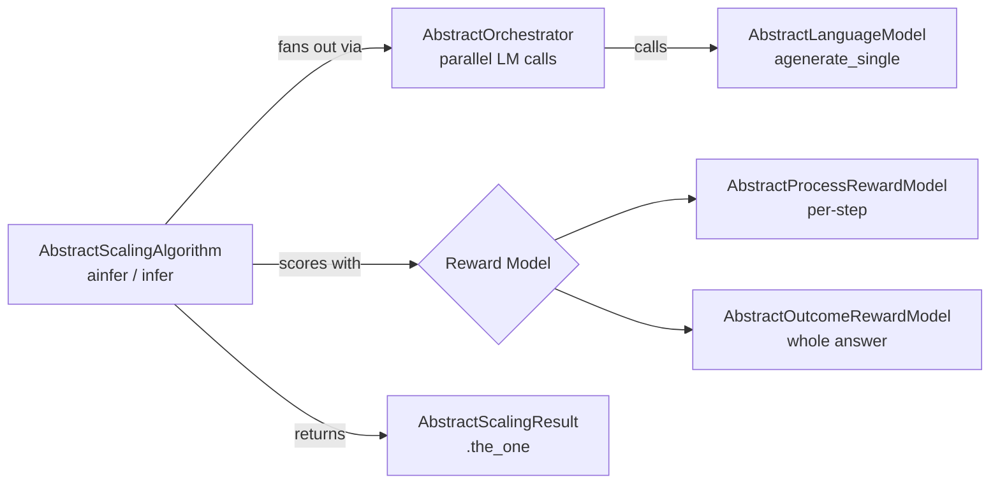

# Chapter 2 — The Architecture: The Cast and the Stage

> *Previous: [The Problem](01-the-problem.md) · Next: [Generating Text](03-generating-text.md)*

Before we open up any single algorithm, let's meet the shared contracts. Every algorithm in `its_hub`
plugs into the same five abstractions, and once you know them, each algorithm becomes "just" a different
way of orchestrating these pieces.

## `api/` vs `core/` — interfaces vs implementations

The package is split deliberately:

```
its_hub/
├── api/      ← STABLE interfaces (abstract base classes). Depend on these.
│   ├── lm.py              AbstractLanguageModel
│   ├── algorithm.py       AbstractScalingAlgorithm, AbstractScalingResult
│   ├── orchestrator.py    AbstractOrchestrator
│   ├── types.py           ChatMessage, ChatMessages
│   └── reward_models/
│       ├── prm.py         AbstractProcessRewardModel
│       └── orm.py         AbstractOutcomeRewardModel
└── core/     ← IMPLEMENTATIONS (may change between versions)
    ├── algorithms/        self_consistency, bon, beam_search, particle_gibbs, planning_wrapper
    ├── lms/               openai_lm (OpenAICompatibleLanguageModel), step_generation
    ├── reward_models/     llm_judge (LLMJudge), local_vllm_prm (LocalVllmProcessRewardModel)
    └── orchestrator.py    LMOrchestrator
```

The rule of thumb stated by the project: **import from the top-level `its_hub` package or from
`its_hub.api`**; treat `its_hub.core` as internal. A *gateway* (someone wiring their own model
infrastructure into these algorithms) implements the `api/` interfaces and never touches `core/`.

This split is also why the dependency footprint is so small. The `api/` layer and the simplest
algorithms need only `numpy`. `OpenAICompatibleLanguageModel` lives in `core/lms` and is gated behind
the `[lm]` extra; the GPU reward model behind `[experimental]`. The top-level
[`its_hub/__init__.py`](../its_hub/__init__.py) imports the heavy pieces inside `try/except` blocks, so
`from its_hub import SelfConsistency` works on a bare install while `OpenAICompatibleLanguageModel`
simply isn't exported if its extra isn't present.

## The five abstractions



### 1. `AbstractLanguageModel` — the text source
The model only knows how to turn messages into a reply. The single method that matters is async:

```python
# its_hub/api/lm.py:38-43
async def agenerate_single(self, messages: list[ChatMessage], stop=None, **kwargs) -> dict:
    ...
```

It returns a **response dict** of the form `{"role": "assistant", "content": "...", "tool_calls": [...]}`
— *text and tool calls, nothing else*. **There are no token logprobs in this contract.** Hold that
thought; it is the single most important fact for understanding where particle weights come from
(spoiler: not from the model). We unpack it in [Chapter 3](03-generating-text.md).

### 2. `AbstractScalingAlgorithm` — the strategy
Every algorithm subclasses this. The interface is one async method plus a free sync wrapper:

```python
# its_hub/api/algorithm.py:36-44
async def ainfer(self, lm, prompt_or_messages, budget,
                 return_response_only=True, tools=None, tool_choice=None) -> dict | AbstractScalingResult: ...
```

The synchronous `infer(...)` is *not* re-implemented by each algorithm — the base class provides it,
wrapping `ainfer` in `asyncio.run` and cleaning up the LM's per-loop session afterward
([`algorithm.py:64-94`](../its_hub/api/algorithm.py#L64-L94)):

```python
# its_hub/api/algorithm.py:79-94
async def _run():
    try:
        return await self.ainfer(lm, prompt_or_messages, budget, return_response_only, tools, tool_choice)
    finally:
        if hasattr(lm, "close_session"):
            await lm.close_session(asyncio.get_running_loop())
return asyncio.run(_run())
```

**Takeaway:** async is the real interface; `infer()` is sugar. If you are already inside an event loop,
call `ainfer`.

### 3. `AbstractScalingResult` — the answer, plus its receipts
When you call with `return_response_only=False`, you get a result object. Its only required member is
the property **`the_one`**, the single chosen response:

```python
# its_hub/api/algorithm.py:8-25
class AbstractScalingResult(ABC):
    @property
    @abstractmethod
    def the_one(self) -> dict:
        """Return the selected best response."""
```

Each algorithm's concrete result adds its own "receipts": Self-Consistency adds the vote `Counter`,
Best-of-N adds `scores`, Particle Filtering adds `log_weights_lst`, and so on. This is how you inspect
*why* a particular answer won — invaluable for debugging and for the demos in
[`snippets/`](snippets/).

### 4. `AbstractOrchestrator` — the concurrency manager
Generating N candidates means N API calls. The orchestrator owns *how* those fan out — parallelism,
rate limits, error propagation — so algorithms don't each reinvent it. Its core method is
`agenerate(lm, messages_lst, ...) -> list[dict]`, returning replies **in input order**. The built-in
`LMOrchestrator` uses `asyncio.TaskGroup` + a thread-safe semaphore; details in
[Chapter 3](03-generating-text.md).

> Note: only **Self-Consistency** and **Best-of-N** currently route through the orchestrator. The
> step-by-step algorithms (Beam Search, Particle Filtering) batch their LM calls directly through
> `StepGeneration` instead. We flag this each time it matters.

### 5. The reward models — the judges
Two flavors, covered in depth in [Chapter 4](04-reward-models.md):

- **`AbstractProcessRewardModel`** (PRM): `score(prompt, steps) -> list[float]` — judges *partial*
  reasoning. Used by Beam Search and Particle Filtering.
- **`AbstractOutcomeRewardModel`** (ORM): `score(messages) -> float | list[float]` — judges *complete*
  conversations. Used by Best-of-N (`LLMJudge` is the built-in example).

## The universal vocabulary

Three words recur in every chapter; pin them down now:

- **`budget`** — an integer compute allowance. Each algorithm interprets it differently (see the
  cheat-sheet in the [README](README.md#the-budget-cheat-sheet)), but it always answers "how much may I
  spend?"
- **`prompt_or_messages`** — input is flexible: a bare `str`, a `list[ChatMessage]`, or a `ChatMessages`
  wrapper. Internally everything is normalized via `ChatMessages.from_prompt_or_messages(...)`
  ([`types.py:86-93`](../its_hub/api/types.py#L86-L93)).
- **`the_one`** — output: the one response the algorithm chose.

With the stage set and the cast introduced, we can follow a single generation request all the way down
to the API — and confirm exactly what does (and does not) come back.

---

*Next: [Chapter 3 — Generating Text](03-generating-text.md).*
