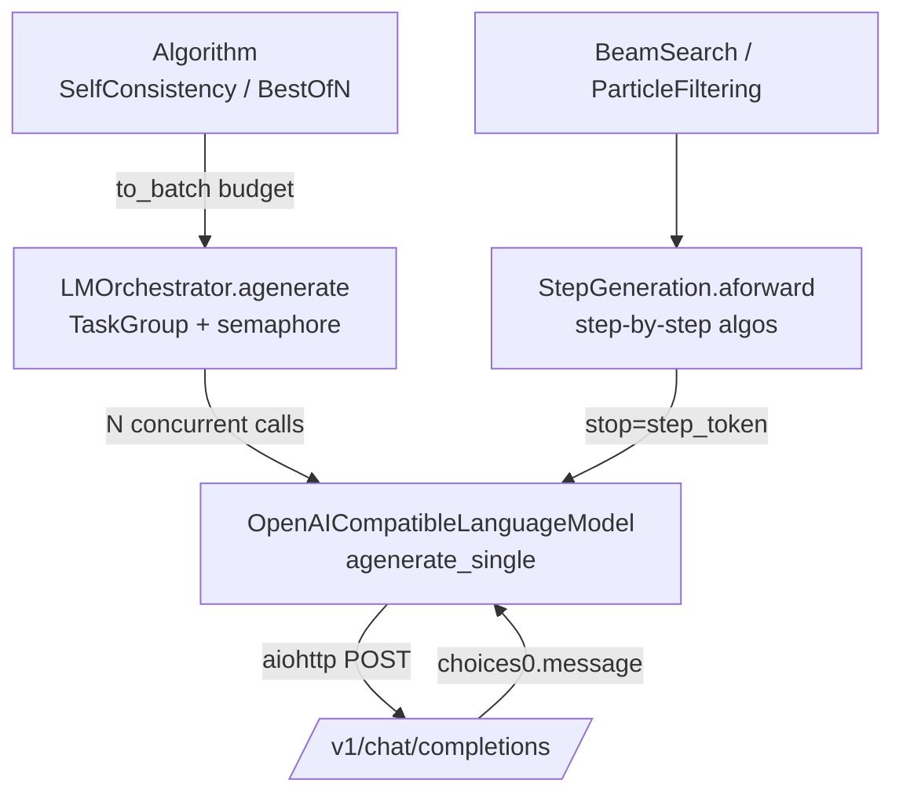

# Chapter 3 — Generating Text: The Machinery (and Why No Logprobs Flow)

> *Previous: [Architecture](02-architecture.md) · Next: [Reward Models](04-reward-models.md)*

This chapter follows a single generation request from an algorithm down to the HTTP call and back. Pay
special attention to the last section — it answers one half of the user's headline question:
*"are they getting just the output from the model, or are they getting log-weights too?"* The answer,
which we prove from the code, is **just the text output**.

## Three pieces of machinery



There are **two ways** an algorithm drives the LM:

1. **Whole-answer algorithms** (Self-Consistency, Best-of-N) ask the **orchestrator** for `budget`
   complete responses at once.
2. **Step-by-step algorithms** (Beam Search, Particle Filtering) drive **`StepGeneration`**, which asks
   the LM for *one reasoning step at a time*.

We take them in turn.

## The language model: `OpenAICompatibleLanguageModel`

This is the production implementation of `AbstractLanguageModel`, talking to any OpenAI-compatible
endpoint — OpenAI itself, or a local **vLLM** server.
([`its_hub/core/lms/openai_lm.py`](../its_hub/core/lms/openai_lm.py))

A few design points worth knowing:

- **Async with per-event-loop session caching.** Sessions live in a
  `weakref.WeakKeyDictionary[loop -> ClientSession]` ([`openai_lm.py:100-105`](../its_hub/core/lms/openai_lm.py#L100-L105)),
  so each event loop reuses one HTTP session and the entry is garbage-collected with the loop. You are
  expected to `await lm.close()` (or use `async with lm:`) for clean shutdown
  ([`openai_lm.py:129-161`](../its_hub/core/lms/openai_lm.py#L129-L161)).
- **Retries with exponential backoff.** Both `agenerate_single` and the legacy `_agenerate` wrap the
  HTTP call in `@backoff.on_exception(backoff.expo, RETRYABLE_ERRORS, max_tries=...)`
  ([`openai_lm.py:398-404`](../its_hub/core/lms/openai_lm.py#L398-L404)) and can optionally swallow
  errors into a placeholder message via `replace_error_with_message`.
- **vLLM vs OpenAI quirks.** For vLLM endpoints it can set `add_generation_prompt=False` /
  `continue_final_message=True` so a partially-written assistant turn is *continued* rather than
  restarted — essential for step-by-step generation ([`openai_lm.py:192-203`](../its_hub/core/lms/openai_lm.py#L192-L203)).
- **`agenerate` is deprecated** in favor of `agenerate_single` + orchestrator
  ([`openai_lm.py:357-362`](../its_hub/core/lms/openai_lm.py#L357-L362)).

### What goes *out* in the request

The request body is assembled in `_prepare_request_data`
([`openai_lm.py:163-239`](../its_hub/core/lms/openai_lm.py#L163-L239)). It can contain `model`,
`messages`, `stop`, `max_tokens`, `temperature`, `tools`, `tool_choice`, and `response_format`. **It
never contains a `logprobs` field.** The library does not ask the API for token probabilities.

### What comes *back* in the response

```python
# its_hub/core/lms/openai_lm.py:430-438 (inside agenerate_single)
response_json = await response.json()
choice = response_json["choices"][0]
message = dict(choice["message"])
if self.include_raw_choices:
    message["_raw_choice"] = {**choice, "message": dict(choice["message"])}
return message
```

Only `choice["message"]` is extracted — i.e. `{"role", "content", "tool_calls"}`. Even when
`include_raw_choices=True`, the preserved `_raw_choice` is the *choice* object the server returned
(index, message, finish_reason); the code does not request or surface token-level `logprobs`.

> ### ⛳ The pivotal fact
> **The LM hands back text (and tool calls). It does not hand back log-probabilities.** So when later
> chapters talk about a particle's "log weight," that number does **not** come from the model's token
> probabilities. It comes entirely from a **reward model** ([Chapter 4](04-reward-models.md)) scoring
> the text, with the log transform applied by the *algorithm*. We will see the exact line in
> [Chapter 7](07-particle-filtering.md).

## The orchestrator: structured concurrency

When Self-Consistency wants `budget` samples, it doesn't loop — it hands a *batch* to the orchestrator.
The built-in `LMOrchestrator` ([`its_hub/core/orchestrator.py`](../its_hub/core/orchestrator.py)) fans
out with Python 3.11's `asyncio.TaskGroup` and bounds concurrency with a **thread-safe** semaphore:

```python
# its_hub/core/orchestrator.py:115-141
async def _gen_coro(messages, temp):
    ctx = self._semaphore if self._semaphore is not None else contextlib.nullcontext()
    async with ctx:
        return await lm.agenerate_single(messages, stop=stop, max_tokens=max_tokens,
                                          temperature=temp, ..., loop=current_loop)

async with asyncio.TaskGroup() as tg:
    tasks = [tg.create_task(_gen_coro(msgs, temp))
             for msgs, temp in zip(messages_lst, temperature_list)]
responses = [task.result() for task in tasks]   # collected in input order
```

Two subtleties:

- **`TaskGroup` gives structured concurrency**: all child tasks complete together, and if one raises,
  the group cancels the rest and propagates an `ExceptionGroup`. No orphaned tasks.
- **The semaphore is a `threading.Semaphore` wrapped for async use**
  ([`orchestrator.py:13-44`](../its_hub/core/orchestrator.py#L13-L44)), so the concurrency cap holds
  *across event loops and threads* — important when the same orchestrator is reused from a sync wrapper
  that spins up fresh loops. Default `max_concurrency=32`; `-1` means unlimited.

This is the seam a gateway team customizes: implement `AbstractOrchestrator` with your own rate-limiting
policy and every algorithm inherits it for free. (See the user-facing
[`docs/orchestration.md`](../docs/orchestration.md) for the integration story.)

## `StepGeneration`: one reasoning step at a time

Beam Search and Particle Filtering don't want a whole answer — they want to grow a solution *step by
step* so a reward model can judge each step. `StepGeneration`
([`its_hub/core/lms/step_generation.py`](../its_hub/core/lms/step_generation.py)) is the adapter that
turns the LM into a step emitter.

You configure it with **exactly one** of:

- `step_token` (e.g. `"\n\n"`): generate until that delimiter appears — that's one "step".
- `tokens_per_step` (an int): generate a fixed number of tokens per step.

…plus a `max_steps` cap and an optional `stop_token` (e.g. `r"\boxed"`) that signals the final answer.

The heart is `aforward`, which builds the running prompt and calls the LM with `stop=step_token`:

```python
# its_hub/core/lms/step_generation.py:132-145 (single-prompt path)
next_step_response = await lm.agenerate(
    messages, stop=self.step_token, max_tokens=self.tokens_per_step,
    temperature=self._get_temperature(messages),
    include_stop_str_in_output=self.include_stop_str_in_output, tools=tools, tool_choice=tool_choice,
)
next_step = extract_content_from_lm_response(next_step_response)
is_stopped = len(steps_so_far) >= self.max_steps
if self.stop_token:
    is_stopped = is_stopped or self.stop_token in next_step
```

Three things to notice:

1. **The "is this done?" decision is made *here*, not by the model's `finish_reason`.** A step-by-step
   trajectory stops when it hits `max_steps` **or** the `stop_token` appears in the generated text
   ([`step_generation.py:142-144`](../its_hub/core/lms/step_generation.py#L142-L144)).
2. **The growing trajectory is replayed each step.** Prior steps are folded back into the prompt as an
   assistant message via `_post_process` ([`step_generation.py:54-71`](../its_hub/core/lms/step_generation.py#L54-L71)),
   and `aforward` has a **batched** path ([`step_generation.py:146-190`](../its_hub/core/lms/step_generation.py#L146-L190))
   so *all* beams/particles advance one step in a single batched LM call.
3. **`_post_process(steps, stopped=True)`** reassembles the steps into the full response string — this
   exact string is what gets handed to the reward model for scoring (next chapter).

### `ChatMessage` / `ChatMessages`

Everything above speaks in `ChatMessage` (a `role` + `content` + optional `tool_calls`/`tool_call_id`
dataclass) and the `ChatMessages` wrapper that normalizes a bare string, a message list, or an existing
wrapper ([`its_hub/api/types.py`](../its_hub/api/types.py)). Two helpers you'll see constantly:

- `to_batch(size)` — make `size` identical copies of a conversation for parallel sampling
  ([`types.py:101-104`](../its_hub/api/types.py#L101-L104)). This is how `budget` becomes N requests.
- `to_prompt()` — flatten a conversation back to a single string, used by the "legacy" step-by-step
  algorithms that still pass prompts as strings ([`types.py:106-131`](../its_hub/api/types.py#L106-L131)).

---

With text flowing and proven logprob-free, we can meet the components that actually produce the numbers
the search algorithms optimize: the **reward models**.

*Next: [Chapter 4 — Reward Models](04-reward-models.md).*
