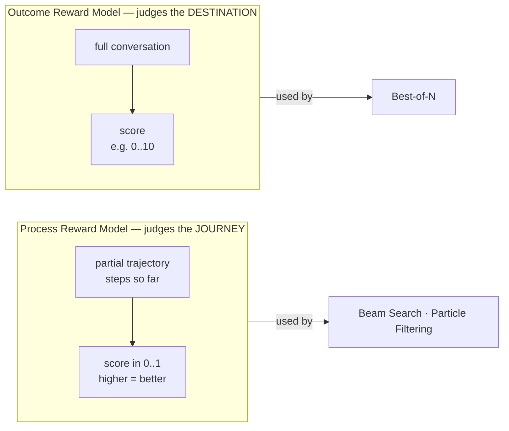

# Chapter 4 — Reward Models: How "Good" Becomes a Number

> *Previous: [Generating Text](03-generating-text.md) · Next: [The Simple Scalers](05-self-consistency-and-best-of-n.md)*

In [Chapter 3](03-generating-text.md) we proved the language model returns only text. So where do the
*scores* that drive Beam Search and Particle Filtering come from? From **reward models** — the topic of
this chapter and the second half of the user's question, *"how are the reward functions modeled?"*

There are two kinds, distinguished by **what they judge** and **when**.



## Process vs. Outcome — the interfaces

### `AbstractProcessRewardModel` (PRM)
A PRM scores *partial* reasoning. Its contract
([`its_hub/api/reward_models/prm.py:13-49`](../its_hub/api/reward_models/prm.py#L13-L49)):

```python
def  score(self, prompt_or_messages, steps: list[str]) -> list[float]: ...
async def ascore(self, prompt_or_messages, steps: list[str]) -> list[float]: ...
# Docstring: "Higher score = better response"
```

It takes a prompt and a **batch of (partial) responses**, and returns one `float` per response. The
docstring fixes the *direction* (higher is better) but — importantly — **does not fix the range**. The
algorithms that consume a PRM, however, *do* assume the scores look like **probabilities in $[0,1]$**
(we'll see exactly why in [Chapter 7](07-particle-filtering.md)). The built-in PRM honors that.

### `AbstractOutcomeRewardModel` (ORM)
An ORM scores a *complete* conversation
([`its_hub/api/reward_models/orm.py:7-51`](../its_hub/api/reward_models/orm.py#L7-L51)):

```python
def  score(self, messages, **kwargs) -> float | list[float]: ...
async def ascore(self, messages, orchestrator=None, **kwargs) -> float | list[float]:  # default: NotImplementedError
```

Note the asymmetry: an ORM's **async** `ascore` is *optional* — the base class raises
`NotImplementedError` unless overridden ([`orm.py:36-51`](../its_hub/api/reward_models/orm.py#L36-L51)).
That's deliberate: the flagship ORM, `LLMJudge`, *only* works async (it makes API calls) and so does the
reverse — its **sync** `score` raises `NotImplementedError`.

| | PRM (process) | ORM (outcome) |
|---|---|---|
| Judges | partial trajectory (steps so far) | complete conversation |
| Returns | `list[float]` (one per candidate) | `float` or `list[float]` |
| Assumed range | $[0,1]$ (probability-like) by consumers | algorithm-defined (e.g. 0–10 for the judge) |
| Built-in impl | `LocalVllmProcessRewardModel` | `LLMJudge` |
| Used by | Beam Search, Particle Filtering | Best-of-N |

## `LLMJudge` — an LLM as the outcome reward model

The simplest ORM doesn't need a special reward model at all: it asks an LLM to grade the answer.
([`its_hub/core/reward_models/llm_judge.py`](../its_hub/core/reward_models/llm_judge.py))

The default prompt ([`llm_judge.py:26-32`](../its_hub/core/reward_models/llm_judge.py#L26-L32)):

```text
Score the following conversation on a scale of 0-10.
Return only a JSON object with your score.

Conversation:
{conversation}

Format: {"score": <number>}
```

It can also request OpenAI **structured outputs** — a strict JSON schema requiring `score` and
`reasoning` fields ([`llm_judge.py:34-49`](../its_hub/core/reward_models/llm_judge.py#L34-L49)) — which is
forwarded to the LM through the orchestrator. Parsing is defensive
([`_parse_score`, `llm_judge.py:142-176`](../its_hub/core/reward_models/llm_judge.py#L142-L176)):

1. Try a clean `json.loads`.
2. Try to pull JSON out of a ```` ```json ```` markdown block.
3. Regex-grab `"score"\s*:\s*([\d.]+)` from truncated output.
4. Fall back to `fallback_score` (default `5.0`) if all else fails.

`ascore` batches all conversations through the orchestrator, then parses each reply
([`llm_judge.py:193-233`](../its_hub/core/reward_models/llm_judge.py#L193-L233)). A nice design touch:
`LLMJudge` **reuses the same `AbstractLanguageModel` instance** you're already scaling — no second
client to configure (this was a deliberate simplification noted in
[`BREAKING_CHANGES.md`](../BREAKING_CHANGES.md)).

## `LocalVllmProcessRewardModel` — a real step-level PRM

For Beam Search and Particle Filtering you need a genuine *process* reward model — one trained to look
at a partial chain of reasoning and say "this is going well / badly". `its_hub` wraps the
[`reward-hub`](https://pypi.org) library's vLLM PRM
([`its_hub/core/reward_models/local_vllm_prm.py`](../its_hub/core/reward_models/local_vllm_prm.py)).

```python
# its_hub/core/reward_models/local_vllm_prm.py:22-34
def __init__(self, model_name: str, device: str, aggregation_method: AggregationMethod):
    self.model = VllmProcessRewardModel(model_name=model_name, device=device)
    self.aggregation_method = aggregation_method
```

A typical instantiation (from [`examples/test_math_example.py`](../examples/test_math_example.py)) loads
`Qwen/Qwen2.5-Math-PRM-7B` on `cuda:0` with `aggregation_method="prod"`.

`ascore` builds, for each candidate response, a `[user, assistant]` conversation and calls the
underlying model **in a worker thread** (so it doesn't block the event loop):

```python
# its_hub/core/reward_models/local_vllm_prm.py:68-74
res = await asyncio.to_thread(
    self.model.score,
    messages=messages,
    aggregation_method=self.aggregation_method,
    return_full_prm_result=False,    # <-- return the AGGREGATED scalar, not per-step breakdown
)
return res[0] if is_single_response else res
```

### The crucial detail: where per-step multiplication lives

A process reward model internally produces a score **for every step** of the trajectory. The
`aggregation_method` decides how those per-step scores collapse into the single number `ascore` returns:

- **`"prod"`** — multiply the per-step probabilities together: $s = \prod_t s_t$. A trajectory is only
  "good" if *every* step is good. This is the example default.
- **`"mean"`** — average them.
- **`"last"`** — take the final step's score.

> **This is the only place a *product* of per-step rewards happens.** When [Chapter 7](07-particle-filtering.md)
> says the particle filter does *not* multiply weights across steps, it's because the multiplication (if
> any) already happened *here*, inside `reward-hub`, before the filter ever sees the number. The filter
> receives one aggregated probability per (partial) trajectory and works with that.

Because this PRM needs a 7B model on a GPU, it lives behind the `[experimental]` extra and is the reason
particle filtering can't run on a laptop. The user-facing `its_scale.sh` plugin deliberately refuses
particle filtering / beam search and tells you to use the Python API
([Chapter 12](12-running-it.md)).

## What the mocks tell us about the contract

The test mocks ([`tests/mocks/reward_models.py`](../tests/mocks/reward_models.py)) are the cleanest
statement of the *expected* contract, because they're the minimum that makes the algorithms work:

- `MockProcessRewardModel.score(prompt, response_or_responses)` returns a `float` for a single response
  or a `list[float]` for a batch — cycling through a preset list of scores. No range is enforced, but
  the presets are probability-like (e.g. the resampling test uses `min(0.5 + 0.1*num_steps, 0.9)`).
- `MockOutcomeRewardModel.score(messages)` detects batch-vs-single by `isinstance(messages[0], list)`
  and returns `list[float]` or `float` accordingly.

That single batch-vs-single convention — *"a list of conversations ⇒ a list of scores; one conversation
⇒ one score"* — is the contract every reward model in the codebase follows.

## So, "how are reward functions modeled?"

Three distinct ways, depending on what you have:

1. **No reward model at all** — Self-Consistency uses *agreement* as an implicit reward (next chapter).
2. **An LLM judge** (`LLMJudge`) — cheap, API-only, outcome-level, 0–10 scale. Good for Best-of-N when
   you have no trained reward model.
3. **A trained process reward model** (`LocalVllmProcessRewardModel` → `reward-hub`) — GPU-hosted,
   step-level, probability-valued, with a choice of step aggregation. This is what unlocks the
   probabilistic search algorithms.

The reward is always *external to the LM* and always reduces to "higher = better." How that number then
becomes a *weight* — logit, softmax, resampling — is the story of Chapters 6–8.

---

*Next: [Chapter 5 — The Simple Scalers](05-self-consistency-and-best-of-n.md).*
