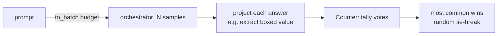
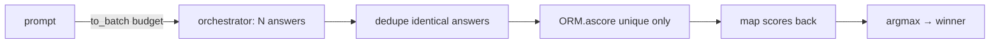

# Chapter 5 — The Simple Scalers: Self-Consistency & Best-of-N

> *Previous: [Reward Models](04-reward-models.md) · Next: [Beam Search](06-beam-search.md)*

These two algorithms are the "embarrassingly parallel" members of the family: generate `budget` complete
answers at once, then pick a winner. They need no step-by-step machinery, which makes them the perfect
warm-up before the sequential algorithms. They differ only in *how* they choose the winner —
**agreement** vs. a **reward**.

## Self-Consistency: the wisdom of the crowd

> **Intuition:** sample the model `budget` times; the final answer that the most samples agree on is
> probably the right one. No reward model required — *consensus is the signal*.

([`its_hub/core/algorithms/self_consistency.py`](../its_hub/core/algorithms/self_consistency.py))



### The flow

`ainfer` fans out `budget` identical prompts through the orchestrator, then votes
([`self_consistency.py:175-193`](../its_hub/core/algorithms/self_consistency.py#L175-L193)):

```python
# its_hub/core/algorithms/self_consistency.py:187-193
responses = await self.orchestrator.agenerate(
    lm, chat_messages.to_batch(budget), tools=tools, tool_choice=tool_choice
)
return self._process_responses(responses, return_response_only)
```

### Projection: voting on the *answer*, not the prose

You rarely want to vote on raw text — two correct solutions may be worded differently. So each response
is passed through a **projection function** that extracts the thing you actually want to compare. The
default just strips whitespace ([`_default_projection_func`, `self_consistency.py:21-30`](../its_hub/core/algorithms/self_consistency.py#L21-L30)),
but for math you'd extract the boxed answer. The library ships a helper that builds a projection from
regex patterns ([`create_regex_projection_function`, `self_consistency.py:316-375`](../its_hub/core/algorithms/self_consistency.py#L316-L375)) — e.g. `r"\\boxed\{([^}]+)\}"` so
`"...\boxed{42}"` projects to `("42",)` and all answers equal to 42 vote together.

The vote itself is a `Counter`, with **random tie-breaking** among equally-popular winners
([`_select_most_common_or_random`, `self_consistency.py:44-63`](../its_hub/core/algorithms/self_consistency.py#L44-L63)):

```python
# its_hub/core/algorithms/self_consistency.py:48-61
counts = Counter(list_to_select_from)
max_count = max(counts.values())
most_common_indices = [i for i, r in enumerate(list_to_select_from) if counts[r] == max_count]
selected_index = random.choice(most_common_indices)
```

### Tool voting and hierarchical voting

A standout feature: Self-Consistency can vote on **tool calls**, not just text. If a majority of
responses contain `tool_calls` *and* you set `tool_vote`, it switches modes
([`self_consistency.py:199-230`](../its_hub/core/algorithms/self_consistency.py#L199-L230)):

- `tool_vote="tool_name"` — vote on the function name only.
- `tool_vote="tool_args"` — vote on the arguments (converted to a hashable tuple).
- `tool_vote="tool_hierarchical"` — vote on `(name, args)` *hierarchically*.

Hierarchical voting ([`_select_hierarchical_most_common_or_random`, `self_consistency.py:66-123`](../its_hub/core/algorithms/self_consistency.py#L66-L123)) is the clever bit: it
processes the tuple **level by level**, at each level keeping only the candidates that share the most
common value, until one winner remains or it runs out of levels. So it first finds the most-agreed tool
*name*, then — among only those — the most-agreed *arguments*. `exclude_args` lets you ignore
non-semantic fields (timestamps, request IDs) so they don't fragment the vote.

> **Gotcha worth knowing:** when tool voting is active, responses *without* tool calls are filtered out
> entirely before voting, and vice-versa for content voting
> ([`self_consistency.py:213-238`](../its_hub/core/algorithms/self_consistency.py#L213-L238)). If
> *every* response has tool calls but you forgot to set `tool_vote`, you get a `ValueError`.

### The result

`SelfConsistencyResult` exposes all responses, the vote `Counter` (`response_counts`), and the winner's
index ([`self_consistency.py:33-41`](../its_hub/core/algorithms/self_consistency.py#L33-L41)). `the_one`
returns the winning *original* response (not the projection).

## Best-of-N: generate many, keep the best

> **Intuition:** generate `budget` full answers, score each with an **outcome** reward model, keep the
> highest. Where Self-Consistency trusts the crowd, Best-of-N trusts a judge.

([`its_hub/core/algorithms/bon.py`](../its_hub/core/algorithms/bon.py))



### Dedup before you score

Scoring is the expensive part (it may be an LLM call per candidate), so Best-of-N **deduplicates first**
([`_dedupe_responses_with_inverse`, `bon.py:60-89`](../its_hub/core/algorithms/bon.py#L60-L89)). It builds
a canonical key per response from its content *and* tool calls
([`_response_to_hashable_key`, `bon.py:16-57`](../its_hub/core/algorithms/bon.py#L16-L57)), keeps the
uniques, and remembers an `inverse_idx` so scores can be mapped back. Example from the docstring:
`[r1, r2, r1, r3, r2] → ([r1, r2, r3], [0, 1, 0, 2, 1])`. Ten identical samples become one scoring call.

### Score, map back, argmax

```python
# its_hub/core/algorithms/bon.py:146-163
unique_responses, inverse_idx = _dedupe_responses_with_inverse(responses)
if len(unique_responses) == 1:                      # everything identical → skip scoring
    scores = [1.0] * len(responses)
    ...
unique_conversations = [[*chat_messages.to_chat_messages(), ChatMessage.from_dict(cand)]
                        for cand in unique_responses]
unique_scores = await self.orm.ascore(unique_conversations, orchestrator=self.orchestrator)
scores = [unique_scores[idx] for idx in inverse_idx]   # back to original order
selected_index = scores.index(max(scores))             # argmax (first max on ties)
```

Two things to note:

- The ORM is given the **full conversation** (original messages + the candidate answer), not the answer
  in isolation — so the judge can weigh contextual appropriateness, not just standalone quality.
- Selection is **deterministic** `argmax`; ties go to the first occurrence.

`BestOfNResult` exposes `responses`, the per-response `scores`, and `selected_index`
([`bon.py:92-100`](../its_hub/core/algorithms/bon.py#L92-L100)).

## Self-Consistency vs Best-of-N: when to use which

| | Self-Consistency | Best-of-N |
|---|---|---|
| Needs a reward model? | **No** (uses agreement) | **Yes** (an ORM/judge) |
| Best when | the answer is a *discrete, checkable* token (a number, a label, a tool call) | quality is graded and answers are open-ended/prose |
| Failure mode | the model is *consistently* wrong → the crowd agrees on the wrong answer | the judge is miscalibrated → it rewards the wrong answer |
| Determinism | random tie-break | `argmax` |
| Cost | `budget` generations | `budget` generations + scoring of the *unique* ones |

Both spend `budget` as "number of parallel generations." Neither looks *inside* the reasoning — they
judge only finished answers. The next three chapters are about algorithms that judge the reasoning *as
it happens*.

A runnable, GPU-free Self-Consistency demo that prints the vote `Counter` is in
[`snippets/self_consistency_demo.py`](snippets/self_consistency_demo.py).

---

*Next: [Chapter 6 — Beam Search](06-beam-search.md), the first step-by-step searcher.*
