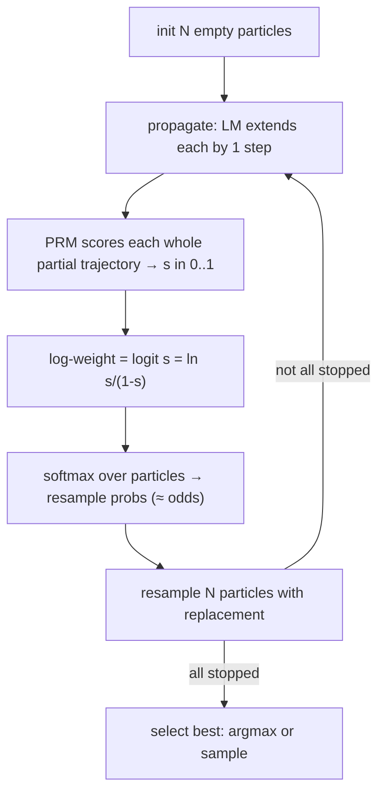

# Chapter 7 — Particle Filtering: Where Reward Becomes Log-Weight

> *Previous: [Beam Search](06-beam-search.md) · Next: [Entropic Particle Filtering](08-entropic-particle-filtering.md)*

This is the chapter the deep-dive was commissioned for. By the end you will know **exactly** how a
particle's "log weight" is computed, line by line, and be able to answer the question that started it
all: *are they multiplying or adding?* Short answer up front, then the full derivation:

> **Per particle, the weight at step $t$ is the *logit* of the PRM's score of the entire partial
> trajectory so far** — re-derived each step, **not** accumulated by a running sum or product in the
> filter. **Across particles**, the weights are turned into a resampling distribution with a **softmax**,
> so particle $i$'s resample probability is $\propto \frac{s_i}{1-s_i}$ (its *odds*). Any *product* of
> per-step rewards happens **inside the PRM** (`aggregation_method="prod"`), never in the filter itself.

All code in this chapter is from
[`its_hub/core/algorithms/particle_gibbs.py`](../its_hub/core/algorithms/particle_gibbs.py).

## The big idea: inference scaling as Sequential Monte Carlo

Particle filtering reframes "search for a good answer" as **sampling from a reward-tilted distribution**.
Imagine the distribution over reasoning trajectories where good trajectories (high reward) are more
likely. We can't sample it directly. So we use **Sequential Monte Carlo (SMC)**, a.k.a. a *particle
filter*:

1. **Sample** a population of $N$ trajectories ("particles"), all starting empty.
2. **Propagate**: extend every particle by one reasoning step (using the LM).
3. **Weight**: score each particle's partial trajectory with the PRM and turn the score into a weight.
4. **Resample**: draw a new population of $N$ particles *with replacement*, in proportion to the
   weights. Good particles get cloned; bad ones die out.
5. Go to 2 until all particles finish. Return the best surviving particle.

This is the classic *sample → weight → resample* loop of the bootstrap particle filter (Gordon, Salmond
& Smith 1993; Doucet, de Freitas & Gordon 2001), applied to LLM reasoning by Puri et al. (2025). See
[Chapter 99](99-glossary-and-references.md) for citations.



## A particle, precisely

```python
# its_hub/core/algorithms/particle_gibbs.py:44-63
@dataclass
class Particle:
    steps: list[str]
    is_stopped: bool
    partial_log_weights: list[float]   # one entry per step taken

    @property
    def log_weight(self) -> float:
        """Return the most recent log weight."""
        if self.partial_log_weights:
            return self.partial_log_weights[-1]
        return 0.0
```

Two facts that matter enormously:

- `partial_log_weights` is a **list** that grows by one entry per step — it stores a *history*.
- But `log_weight`, the number used for selection, is **`partial_log_weights[-1]`** — the **latest** one,
  **not** the sum or product of the list. The history exists for fairness during resampling (Chapter 9),
  not for accumulation.

## The weight, line by line

Inside `_apropagate`, after the LM extends each particle by one step, the PRM scores the **whole prefix
so far**, then the score is converted to a log-weight
([`particle_gibbs.py:184-199`](../its_hub/core/algorithms/particle_gibbs.py#L184-L199)):

```python
# its_hub/core/algorithms/particle_gibbs.py:185-199
scores = await self.prm.ascore(
    prompt,
    [self.sg._post_process(steps_so_far_per_prompt, stopped=True)   # the ENTIRE partial trajectory
     for steps_so_far_per_prompt in steps_so_far],
)
# ...
for p, is_stopped in zip(particles, is_stopped_in_the_beginning):
    if is_stopped:
        continue
    p.partial_log_weights.append(_inv_sigmoid(scores[i]))           # ← reward → log-weight
    i += 1
```

The transform is the **inverse sigmoid**, i.e. the **logit**
([`particle_gibbs.py:66-70`](../its_hub/core/algorithms/particle_gibbs.py#L66-L70)):

```python
def _inv_sigmoid(x):
    assert 0 <= x <= 1, "x must be between 0 and 1"
    x = np.clip(x, 1e-7, 1 - 1e-7)     # avoid log(0) / log(inf)
    return np.log(x / (1 - x))
```

### The math of the weight

The PRM returns a probability-like score $s_t \in [0,1]$ for the partial trajectory after step $t$. The
particle's log-weight at step $t$ is

$$
w_t \;=\; \operatorname{logit}(s_t) \;=\; \ln\!\frac{s_t}{1-s_t}.
$$

This is the **log-odds** of the reward. It maps the bounded score onto the whole real line: $s=0.5 \to 0$,
$s\to 1 \Rightarrow w\to +\infty$, $s\to 0 \Rightarrow w\to -\infty$. Working in log-space is the
numerically stable home for weights — it is the natural domain for the softmax that follows.

> **Why logit and not just $\ln s$?** Because the resampling step exponentiates the weight. With
> $w=\operatorname{logit}(s)$, $\exp(w) = \frac{s}{1-s}$ — the **odds**. So a particle's *unnormalized*
> resampling mass is its odds of being "good," which sensibly amplifies differences near $s=1$ (a step
> the PRM is very confident about) and is symmetric about $s=0.5$.

## Resampling: from weights to a new population

Each outer step, the filter gathers one weight per particle, softmax-normalizes them, and resamples
([`particle_gibbs.py:413-438`](../its_hub/core/algorithms/particle_gibbs.py#L413-L438)):

```python
# its_hub/core/algorithms/particle_gibbs.py:415-438
log_weights = []
for p in particles:
    if p.is_stopped:
        log_weights.append(p.log_weight)                      # finished: its final weight
    else:
        log_weights.append(p.partial_log_weights[current_step - 1])   # active: weight at THIS step

probabilities = _softmax(log_weights)
# (entropic annealing optionally rescales here — see Chapter 8)
resampled_particles = self._resampling(particles, probabilities, num_free_particles)
```

The softmax ([`particle_gibbs.py:73-76`](../its_hub/core/algorithms/particle_gibbs.py#L73-L76)) is the
standard numerically-stable form. Its effect on our logit weights is illuminating:

$$
P(\text{resample } i) \;=\; \frac{e^{w_i}}{\sum_j e^{w_j}}
\;=\; \frac{\frac{s_i}{1-s_i}}{\sum_j \frac{s_j}{1-s_j}}.
$$

**A particle is resampled in proportion to its odds, normalized across the population.** That single
equation is the entire selection mechanism of the particle filter.

### Two resampling schemes

```python
# its_hub/core/algorithms/particle_gibbs.py:340-353
def _resampling_multinomial(self, particles, probabilities, num_particles):
    return random.choices(particles, weights=probabilities, k=num_particles)
```

- **Multinomial** (default for plain PF): draw $N$ particles i.i.d. from the categorical distribution.
  Simple, higher variance.
- **Systematic** ([`particle_gibbs.py:308-338`](../its_hub/core/algorithms/particle_gibbs.py#L308-L338)):
  one uniform random offset, then evenly-spaced "comb" positions over the cumulative distribution. Lower
  variance, better diversity — and the default for **Entropic** PF (Chapter 8).

After resampling, survivors are `deepcopy`-d so clones diverge independently
([`particle_gibbs.py:447`](../its_hub/core/algorithms/particle_gibbs.py#L447)) — the same trick Beam
Search uses.

## The "multiply vs add" question, settled

Let's answer it from three angles, because it's subtle.

**1. Across *steps*, within one particle — neither add nor multiply (in the filter).**
The weight used at step $t$ is `partial_log_weights[-1]` $= \operatorname{logit}(s_t)$. The code never
computes $\sum_t w_t$ or $\prod_t s_t$ over the particle's own history. Each step's weight *overwrites*
the role of "the weight" — it is the logit of the PRM's score of the **whole prefix up to $t$**. The
"process" accumulation is delegated to the PRM, which already looked at all $t$ steps.

**2. Inside the PRM — multiplication *can* happen.**
If the PRM is `LocalVllmProcessRewardModel(aggregation_method="prod")`, then *its* returned score is
$s_t = \prod_{k\le t} s^{\text{(step)}}_k$ — a product of per-step probabilities
([Chapter 4](04-reward-models.md)). So multiplication of step rewards lives **inside reward-hub**, before
the filter. With `"last"` it's just the final step's score; with `"mean"`, an average. The filter is
agnostic — it logit-transforms whatever scalar it gets.

**3. Across *particles* — softmax (which is "add in log-space, then normalize").**
Resampling combines particles' weights via $\frac{e^{w_i}}{\sum_j e^{w_j}}$. The denominator is a sum of
exponentials of log-weights — i.e. the weights *interact additively in log-space* to form a probability
distribution, never multiplicatively.

So if someone asks "do they add or multiply the log-weights?", the precise answer is:
**the filter takes the logit of a (possibly product-aggregated) reward as the instantaneous log-weight,
and combines particles via softmax — it does not itself accumulate a per-particle weight across steps by
either summing or multiplying.** A runnable demonstration that prints every particle's
`partial_log_weights` and the resulting softmax probabilities is in
[`snippets/epf_logweights_demo.py`](snippets/epf_logweights_demo.py).

## Degeneracy: why naive weighting isn't enough

There is a well-known pathology in particle filters called **weight degeneracy**: after a few steps,
almost all the probability mass concentrates on a single particle, and resampling just makes $N$ copies
of it. Diversity collapses; you've effectively spent $N×$ compute to follow one path. The standard
diagnostic is the **Effective Sample Size**
([`particle_gibbs.py:228-243`](../its_hub/core/algorithms/particle_gibbs.py#L228-L243)):

$$
\mathrm{ESS} \;=\; \frac{1}{\sum_i p_i^{\,2}} \quad\in [1, N].
$$

If all particles are equal, $\mathrm{ESS}=N$ (healthy). If one dominates, $\mathrm{ESS}\to 1$ (degenerate).
Plain `ParticleFiltering` computes weights and resamples but does **not** act on ESS. Fixing degeneracy
— keeping the swarm diverse early — is precisely what **Entropic** Particle Filtering adds, and the ESS
is the trigger it watches. That's the next chapter.

## Budget, selection, and the result

`ParticleFiltering` is `ParticleGibbs` with `num_iterations=1`
([`particle_gibbs.py:503-525`](../its_hub/core/algorithms/particle_gibbs.py#L503-L525)), so
**`budget = num_particles`** ([`particle_gibbs.py:379-383`](../its_hub/core/algorithms/particle_gibbs.py#L379-L383)).
The final answer is chosen from the surviving population by
`final_response_selection` ([`particle_gibbs.py:482-490`](../its_hub/core/algorithms/particle_gibbs.py#L482-L490)):

- `ARGMAX` (default): the particle with the highest final log-weight.
- `SAMPLE`: draw one in proportion to the final softmax probabilities.

`ParticleFilteringResult` ([`particle_gibbs.py:32-41`](../its_hub/core/algorithms/particle_gibbs.py#L32-L41))
carries the surviving `responses`, the per-particle `log_weights_lst`, the `selected_index`, and
`steps_used_lst`; `the_one` returns `responses[selected_index]`. Inspecting `log_weights_lst` is the
best way to *see* how compute concentrated.

---

*Next: [Chapter 8 — Entropic Particle Filtering](08-entropic-particle-filtering.md): the namesake, and
the cure for degeneracy.*
