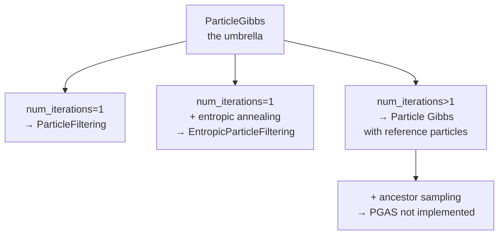

# Chapter 9 — Particle Gibbs & the Family: One Class, Four Algorithms

> *Previous: [Entropic Particle Filtering](08-entropic-particle-filtering.md) · Next: [The Planning Wrapper](10-planning-wrapper.md)*

You may have noticed that the file we keep quoting is called `particle_gibbs.py`, not
`particle_filtering.py`. That's because **one class, `ParticleGibbs`, is the umbrella** that generates
every particle-based variant in the library. `ParticleFiltering` and `EntropicParticleFiltering` are
thin subclasses that pin its knobs. This chapter zooms out to the general framework.

([`its_hub/core/algorithms/particle_gibbs.py`](../its_hub/core/algorithms/particle_gibbs.py))

## The umbrella

```python
# its_hub/core/algorithms/particle_gibbs.py:95-103
class ParticleGibbs(AbstractScalingAlgorithm):
    """
    Particle-based Monte Carlo methods for inference time scaling.
    It supports the following variants:
    - Particle Filtering (PF): num_iterations = 1
    - Entropic Particle Filtering (ePF): num_iterations = 1 and does_entropic_annealing = True
    - Particle Gibbs (PG): num_iterations > 1
    - PG with ancestor sampling (PGAS): num_iterations > 1 and does_ancestor_sampling = True
    """
```

Two flags select the family member:

| Variant | `num_iterations` | `does_entropic_annealing` | `does_ancestor_sampling` | Status |
|---------|------------------|---------------------------|--------------------------|--------|
| **Particle Filtering (PF)** | 1 | False | False | ✅ shipped (`ParticleFiltering`) |
| **Entropic PF (ePF)** | 1 | **True** | False | ✅ shipped (`EntropicParticleFiltering`) |
| **Particle Gibbs (PG)** | **>1** | either | False | ✅ usable via `ParticleGibbs` directly |
| **PG + Ancestor Sampling (PGAS)** | >1 | either | **True** | ⛔ `NotImplementedError` |



## What "Particle Gibbs" adds: reference particles

A single particle-filter sweep is one *sample* from the reward-tilted distribution — it can still get
unlucky. **Particle Gibbs** (Andrieu, Doucet & Holenstein 2010) runs the sweep **multiple times**, and
each new sweep is *conditioned on* a surviving trajectory from the previous one, called a **reference
particle**. This makes the iterations a proper MCMC chain that mixes toward the target distribution
rather than $N$ independent (and individually noisy) guesses.

In code, `ainfer` loops `num_iterations` times
([`particle_gibbs.py:391-480`](../its_hub/core/algorithms/particle_gibbs.py#L391-L480)). After each
sweep it samples `num_ref_particles` survivors *in proportion to their final weights* and carries them
into the next sweep as fixed anchors
([`particle_gibbs.py:461-467`](../its_hub/core/algorithms/particle_gibbs.py#L461-L467)):

```python
# its_hub/core/algorithms/particle_gibbs.py:461-467
log_weights = [p.log_weight for p in particles]
probabilities = _softmax(log_weights)
ref_indices = random.choices(range(len(particles)), weights=probabilities, k=self.num_ref_particles)
ref_particles = [particles[i] for i in ref_indices]
```

The next iteration starts with `num_particles - len(ref_particles)` fresh empty particles plus those
reference particles ([`particle_gibbs.py:391-397`](../its_hub/core/algorithms/particle_gibbs.py#L391-L397)).

### Budget accounting

```python
# its_hub/core/algorithms/particle_gibbs.py:379-383
assert budget % self.num_iterations == 0, "budget must be divisible by num_iterations"
num_particles = budget // self.num_iterations
```

So **`budget = num_particles × num_iterations`** — the budget is split across sweeps. PF/ePF use
`num_iterations=1`, so for them `budget` is simply the particle count.

## The subtle fix: fair weights for reference particles

A reference particle arrives in the new sweep already carrying a *full* trajectory (it finished last
time), while the fresh particles are empty. If, at resampling step $t$, you compared a reference
particle's *final* weight against fresh particles' *step-$t$* weights, the reference would win unfairly
just for being older. This was issue #54. The fix is the `partial_log_weights` **history** we met in
[Chapter 7](07-particle-filtering.md): during resampling, an active particle is judged by its weight
**at the current step**, not its final weight
([`particle_gibbs.py:415-422`](../its_hub/core/algorithms/particle_gibbs.py#L415-L422)) — and if a
reference particle is resampled into the free population, it is **truncated** back to the current step so
all particles have the same length ([`particle_gibbs.py:449-456`](../its_hub/core/algorithms/particle_gibbs.py#L449-L456)):

```python
# its_hub/core/algorithms/particle_gibbs.py:449-456
for p in resampled_particles:
    if len(p.steps) > current_step:                  # an old reference particle
        p.steps = p.steps[:current_step]
        p.partial_log_weights = p.partial_log_weights[:current_step]
        p.is_stopped = False
```

This is *why* `partial_log_weights` is a list rather than a single number — the history is needed to make
cross-age comparisons fair. The regression test
[`tests/test_particle_gibbs_resampling.py`](../tests/test_particle_gibbs_resampling.py) guards it.

## Not yet implemented (but scaffolded)

Two flags raise `NotImplementedError` today, marking intended future work
([`particle_gibbs.py:440-444`](../its_hub/core/algorithms/particle_gibbs.py#L440-L444)):

- **`does_ancestor_sampling`** (→ PGAS): ancestor sampling re-draws the reference trajectory's ancestry
  at each step, which dramatically improves PG's mixing for long sequences (Lindsten, Jordan & Schön
  2014). Scaffolded, not built.
- **`does_lookahead_modulation`**: a hook for adjusting weights using a look-ahead estimate of future
  reward. Scaffolded, not built.

Knowing these exist tells you where the design is heading: better MCMC mixing and value-aware weighting.

## Two result shapes

Because PG produces results *per iteration*, it has its own richer result type
([`particle_gibbs.py:19-41`](../its_hub/core/algorithms/particle_gibbs.py#L19-L41)):

- **`ParticleGibbsResult`** — `responses_lst`, `log_weights_lst`, `ref_indices_lst`, `steps_used_lst`
  are all *lists over iterations*; `the_one = responses_lst[-1][selected_index]` (best particle of the
  last sweep).
- **`ParticleFilteringResult`** — the **flattened, single-iteration** view that `ParticleFiltering` and
  `EntropicParticleFiltering` return ([`particle_gibbs.py:546-557`](../its_hub/core/algorithms/particle_gibbs.py#L546-L557)),
  so users of PF/ePF never see the iteration axis.

## Putting the family in one sentence

`ParticleGibbs` is a configurable SMC engine: **one sweep** with logit-weighted resampling is *particle
filtering*; add **adaptive temperature** and you get *entropic* particle filtering; run **multiple
sweeps with reference particles** and you get *particle Gibbs*; the *ancestor-sampling* refinement
(PGAS) is reserved for later.

---

*Next: [Chapter 10 — The Planning Wrapper](10-planning-wrapper.md), a meta-algorithm that sits on top of
any of these.*
