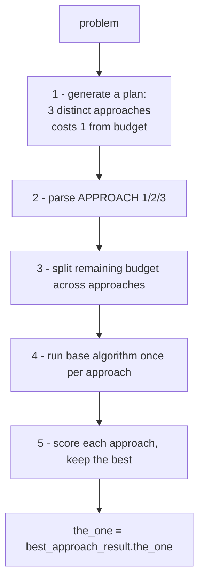

# Chapter 10 — The Planning Wrapper: A Meta-Algorithm

> *Previous: [Particle Gibbs & the Family](09-particle-gibbs.md) · Next: [Putting It Together](11-putting-it-together.md)*

Every algorithm so far explores variations of *one* line of attack on a problem. The **Planning
Wrapper** adds a layer above them: first ask the model to brainstorm a few genuinely different
*approaches*, then run any base algorithm **once per approach** and keep the best result. It's a
meta-algorithm — it wraps Self-Consistency, Best-of-N, Beam Search, or Particle Filtering and makes each
more diverse.

([`its_hub/core/algorithms/planning_wrapper.py`](../its_hub/core/algorithms/planning_wrapper.py); see
also [`docs/PLANNING_WRAPPER.md`](../docs/PLANNING_WRAPPER.md).)

## The five steps



### Step 1 — Plan (costs 1 generation)

A single LM call asks for three distinct strategies, using a fixed template
([`planning_wrapper.py:36-46`](../its_hub/core/algorithms/planning_wrapper.py#L36-L46)):

```text
APPROACH 1: [Brief description of first method/strategy]
APPROACH 2: [Brief description of second method/strategy]
APPROACH 3: [Brief description of third method/strategy]
```

This is the *only* part of the budget that isn't spent by the base algorithm
([`planning_wrapper.py:159-162`](../its_hub/core/algorithms/planning_wrapper.py#L159-L162)).

### Step 2 — Parse

`PlanParser.extract_approaches` ([`planning_wrapper.py:57-91`](../its_hub/core/algorithms/planning_wrapper.py#L57-L91))
pulls the approaches out with a regex (`APPROACH\s+(\d+):...`), and is defensive about messy output:

1. Match the structured `APPROACH n:` format.
2. Fall back to a numbered list (`^\d+\.`).
3. If still fewer than two, fall back to three **hardcoded generic** approaches ("Direct algebraic…",
   "Alternative method…", "Geometric…"). It always returns **2–3** approaches.

### Step 3 — Allocate budget

Remaining budget (`budget - 1`) is split as evenly as possible, with leftovers going to the first
approaches ([`planning_wrapper.py:167-182`](../its_hub/core/algorithms/planning_wrapper.py#L167-L182)):

```python
remaining_budget = budget - 1
budget_per_approach = max(1, remaining_budget // len(approaches))
# remainder distributed to the first (remaining_budget % len(approaches)) approaches
```

So with `budget=16` and 3 approaches: 15 remaining → `[5, 5, 5]`.

### Step 4 — Run the base algorithm per approach

Each approach gets its own prompt and runs the wrapped algorithm with `return_response_only=False`, so
the wrapper keeps each base result object intact
([`planning_wrapper.py:198-205`](../its_hub/core/algorithms/planning_wrapper.py#L198-L205)). The wrapper
collects responses across approaches by sniffing the result's shape — `responses` (SC/BoN),
`all_responses` (PF), or `response_lists` (Beam) — into `combined_responses`
([`planning_wrapper.py:211-223`](../its_hub/core/algorithms/planning_wrapper.py#L211-L223)).

### Step 5 — Pick the best approach

`_get_result_score` is a **duck-typed scorer** that works across *any* base algorithm by probing for
whatever score-like attribute the result happens to expose
([`planning_wrapper.py:266-306`](../its_hub/core/algorithms/planning_wrapper.py#L266-L306)):

1. Scalar/`list` attrs: `best_score`, `max_score`, `score`, `confidence`, `probability`, `weight`.
2. Collections: `scores` (BoN), `all_scores`, or `log_weights_lst` (PF/PG — takes the max log-weight,
   handling both flat and nested shapes).
3. **Last resort:** response *length* as a crude quality proxy.

This is why the wrapper composes with future algorithms for free: it never assumes a specific result
type, only that *some* score-like signal exists (or it falls back to length).

## The result

`PlanningWrappedResult` ([`planning_wrapper.py:16-30`](../its_hub/core/algorithms/planning_wrapper.py#L16-L30))
is unusually rich — it exposes the raw `plan`, the parsed `approaches`, a dict of `approach_results`
(the **full** base-result object per approach), the `approach_budgets`, the `combined_responses`, the
winning `best_approach` name, and `best_approach_result`. `the_one` simply delegates:
`best_approach_result.the_one`.

There are convenience constructors for the common pairings
([`planning_wrapper.py:312-341`](../its_hub/core/algorithms/planning_wrapper.py#L312-L341)):
`create_planning_self_consistency`, `create_planning_best_of_n`,
`create_planning_particle_filtering`, `create_planning_beam_search`.

## When is this worth it?

The Planning Wrapper trades a slice of budget (1 generation + diversification overhead) for **breadth of
strategy**. It shines when a problem has multiple legitimate solution routes and the base algorithm,
left alone, would funnel all its samples down one of them. It is least useful when the base algorithm is
already diverse (high-budget Self-Consistency) or when there's really only one sensible approach. Two
caveats visible in the code:

- Budget allocation is **static** — approaches split the budget evenly up front, with no reallocation
  toward the approach that's doing well.
- Approaches are not checked for genuine distinctness; if the model returns three similar approaches,
  you pay the overhead without the diversity benefit.

---

*Next: [Chapter 11 — Putting It Together](11-putting-it-together.md), where we trace one end-to-end
request and give a decision guide.*
