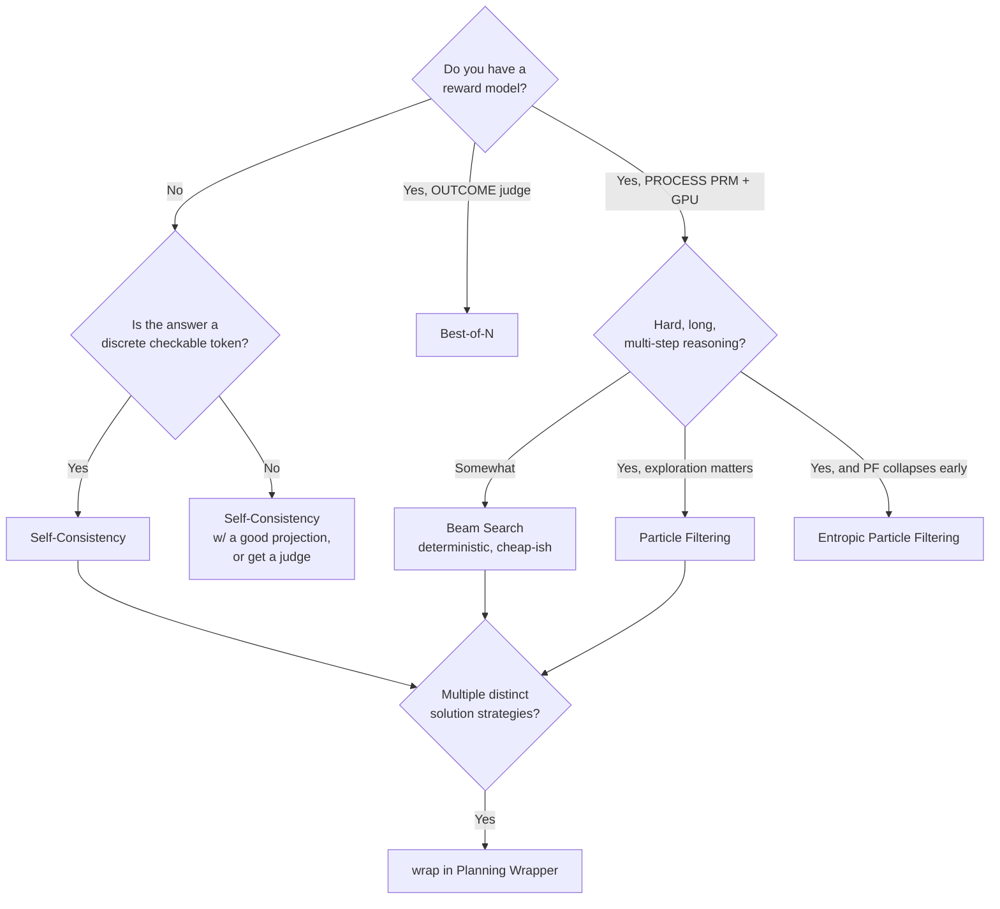

# Chapter 11 — Putting It Together

> *Previous: [The Planning Wrapper](10-planning-wrapper.md) · Next: [Running It](12-running-it.md)*

We've met every component. This chapter zooms back out: one end-to-end trace, a decision guide, and the
mental model that ties the family together.

## One request, end to end

Here is a Particle-Filtering request from prompt to answer, naming the real components at each hop:

```mermaid
sequenceDiagram
    participant U as You
    participant ALG as ParticleFiltering (ainfer)
    participant SG as StepGeneration
    participant LM as OpenAICompatibleLanguageModel
    participant PRM as LocalVllmProcessRewardModel
    U->>ALG: infer(lm, prompt, budget=N)
    Note over ALG: init N empty particles
    loop until all particles stopped
        ALG->>SG: aforward(lm, prompts, steps_so_far)  (batched)
        SG->>LM: agenerate(stop=step_token)  per particle
        LM-->>SG: next step (text only — no logprobs)
        SG-->>ALG: (next_step, is_stopped) per particle
        ALG->>PRM: ascore(prompt, whole-prefix per particle)
        PRM-->>ALG: scores s ∈ [0,1]
        Note over ALG: w = logit(s); softmax over particles; resample
    end
    ALG-->>U: the_one (argmax log-weight)
```

The same skeleton describes Beam Search (swap "softmax + resample" for "sort + keep top-k") and the
whole-answer algorithms (one `orchestrator.agenerate` of `budget` samples, then vote/rerank — no
`StepGeneration`, no per-step loop).

## The data, in one picture

```text
   prompt ──▶ LM(text) ──▶ reward model(number) ──▶ weight/score ──▶ selection ──▶ the_one
              │                    │                      │               │
        no logprobs          PRM: s∈[0,1] (process)   PF: logit(s)     PF: resample
        ever leave           ORM: e.g. 0..10 (outcome) Beam: raw s     Beam/BoN: argmax
        the model            SC: none (agreement)      SC: vote count  SC: most common
```

Three invariants worth re-stating because they unify everything:

1. **The model only ever emits text** ([Chapter 3](03-generating-text.md)). Every score/weight is
   computed *outside* the model by a reward model or by counting votes.
2. **`budget` is the universal currency**, spent differently per algorithm
   ([README cheat-sheet](README.md#the-budget-cheat-sheet)).
3. **`the_one` is the universal output**; pass `return_response_only=False` for the receipts.

## Choosing an algorithm



A pragmatic reading of the decision tree:

- **No reward model, discrete answer** → **Self-Consistency**. Cheapest path to a big accuracy bump on
  math/multiple-choice; just supply a projection that extracts the answer.
- **An LLM judge but no trained PRM** → **Best-of-N**. Good for open-ended quality.
- **A trained PRM + a GPU** → step-by-step search. Use **Beam Search** for a cheap, deterministic
  improvement; **Particle Filtering** when exploration matters; **Entropic PF** when PF collapses too
  early on long problems (the repo's reason for existing).
- **Several genuinely different approaches exist** → wrap any of the above in the **Planning Wrapper**.

## Cost & determinism at a glance

| Algorithm | LM calls (≈) | Reward calls | Deterministic | Needs GPU |
|---|---|---|---|---|
| Self-Consistency | `budget` | 0 | no (tie-break) | no |
| Best-of-N | `budget` | ~unique candidates | yes (argmax) | no¹ |
| Beam Search | `num_beams × steps` | per step | yes (argmax) | yes (PRM) |
| Particle Filtering | `N × steps` | per step | no (resample) | yes (PRM) |
| Entropic PF | `N × steps` | per step | no (resample) | yes (PRM) |
| Planning Wrapper | 1 + base | base | inherits base | inherits base |

¹ Best-of-N needs a GPU only if its ORM is a local model; `LLMJudge` is API-only.

## The mental model to keep

Everything in `its_hub` is one loop with three swappable parts:

> **generate → judge → keep**, repeated until a stopping rule fires, then **select**.

- *generate* is the LM (whole answers, or one step at a time via `StepGeneration`).
- *judge* is the reward signal (a vote, an ORM, or a PRM).
- *keep* is the selection rule (most-common, argmax, or softmax-resample, optionally tempered).

Swap those three and you get all five algorithms. The "entropic" innovation is a refinement of the
*keep* step — temper the resampling distribution so you don't keep too narrowly, too soon.

---

*Next: [Chapter 12 — Running It](12-running-it.md): the conda env, the tests, and the inference paths on
this machine.*
