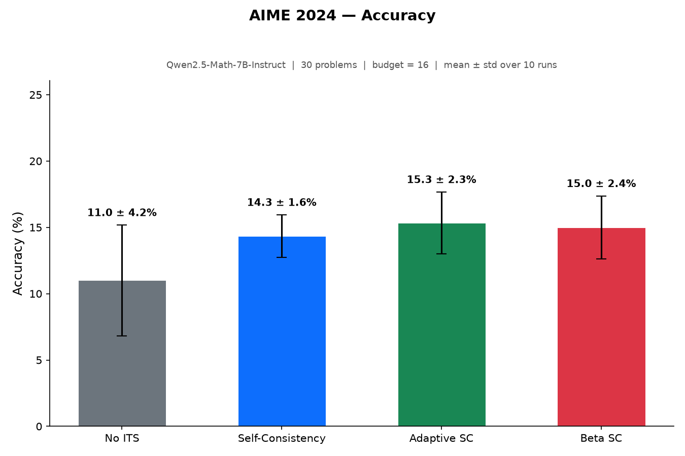
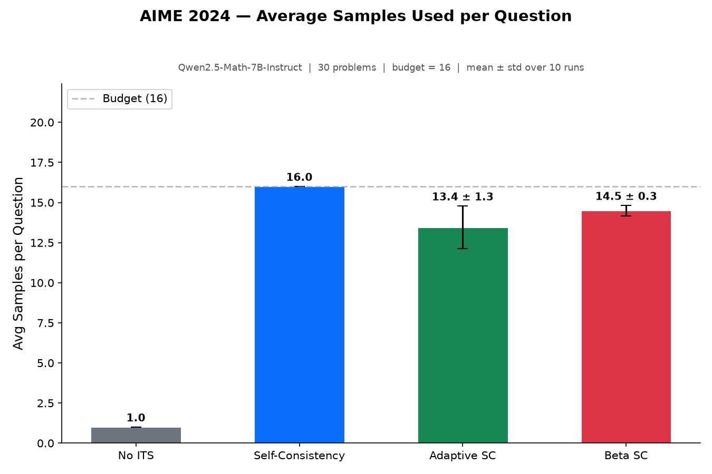
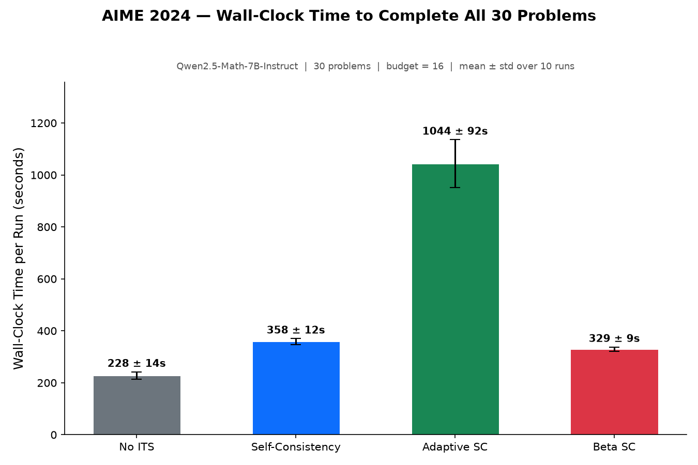

## Algorithms

1.  **No ITS**

2.  **Self-Consistency** (Wang et al., 2022): Generate $N$ independent samples and take the most common answer.

3.  **Adaptive Self-Consistency**: Start with 2 samples, check if a supermajority (75%) agrees. If not, iteratively double the batch size up to $N$ total samples.

4.  **Beta Self-Consistency** (Aggarwal et al., 2023), implemented efficiently: Fire all $N$ requests concurrently and process responses as they arrive. After each response arrives, compute the probability $P$ that the current most common answer is more common than the second most common answer. Cancel all of the pending requests as soon as $P \geq 0.95$.

## Experiment

- **Model**: Qwen2.5-Math-7B-Instruct
- **Benchmark**: AIME 2024 (all 30 problems — AIME I + AIME II)
- **Budget**: 16 samples/question
- **Temperature**: 0.7
- **Serving**: vLLM 0.26.0 on 1x H100, 32 concurrent requests
- **Runs**: 10 per algorithm

## Results

| Algorithm | Accuracy (%) | Avg Samples | Time (s) |
|---|---|---|---|
| No ITS | 11.0 ± 4.2 | 1.0 ± 0.0 | 228.3 ± 13.8 |
| Self-Consistency | 14.3 ± 1.6 | 16.0 ± 0.0 | 358.2 ± 12.1 |
| Adaptive SC | 15.3 ± 2.3 | 13.5 ± 1.3 | 1043.8 ± 92.2 |
| Beta SC | 15.0 ± 2.4 | 14.5 ± 0.3 | 329.2 ± 8.7 |

## Analysis

Unlike on GSM8K, inference-time scaling provides only marginal benefit on AIME 2024 with a 7B model at budget=16.

**Key observations:**

1. **All algorithms perform similarly (~11–15%).** The scaling algorithms provide a modest +3–4 percentage point lift over the baseline, but the differences between SC variants are within noise.

2. **Self-Consistency is highly stable across runs (14.3% ± 1.6).** Majority vote with 16 samples produces near-deterministic winners — the same 4–5 "easy" problems are consistently answered correctly, while harder problems never accumulate enough correct samples for the right answer to win.

3. **No ITS has the highest variance (± 4.2).** Single-shot accuracy on hard competition problems is highly stochastic — a lucky or unlucky generation on a few borderline problems swings the score.

4. **Adaptive SC is the slowest by ~3x** despite using fewer samples on average (13.5 vs 16). The exponential doubling strategy (2 → 4 → 8 → 16) serializes requests into rounds, losing the parallelism that vLLM's continuous batching provides.

5. **Beta SC is the fastest of the scaling algorithms** (329s vs 358s for SC, 1044s for Adaptive SC), consistent with its fire-all-cancel-early design. It saves ~9% of samples on average (14.5 vs 16) with minimal latency overhead.

6. **Beta SC and Adaptive SC achieve similar accuracy to full SC** (15.0% and 15.3% vs 14.3%) while using fewer samples, suggesting they are slightly more sample-efficient on hard problems.

**Why scaling doesn't help much here:** AIME problems are competition-level, and per-sample accuracy with a 7B model is ~10–20%. For majority vote to improve accuracy, the correct answer must appear more frequently than any single wrong answer. On AIME, the model often makes systematic errors (e.g., arithmetic mistakes that produce a consistent wrong answer), so the wrong majority wins. Self-consistency is most effective when per-sample accuracy is moderate (40–70%) and errors are diverse.

## Comparison with GSM8K

| | GSM8K (budget=64) | AIME 2024 (budget=16) |
|---|---|---|
| No ITS | 57.0 ± 3.0 | 11.0 ± 4.2 |
| Self-Consistency | 75.6 ± 1.5 | 14.3 ± 1.6 |
| SC lift over baseline | +18.6 pp | +3.3 pp |
| Beta SC | 73.0 ± 1.9 | 15.0 ± 2.4 |
| Beta SC avg samples | 20.4 ± 1.4 | 14.5 ± 0.3 |

The SC accuracy lift drops from +18.6 percentage points on GSM8K to +3.3 on AIME. This aligns with the theoretical expectation: majority vote amplifies correct answers when they are the plurality, but cannot rescue a model that rarely produces them.
