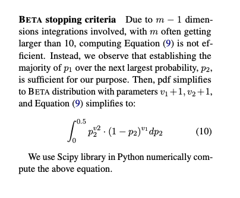
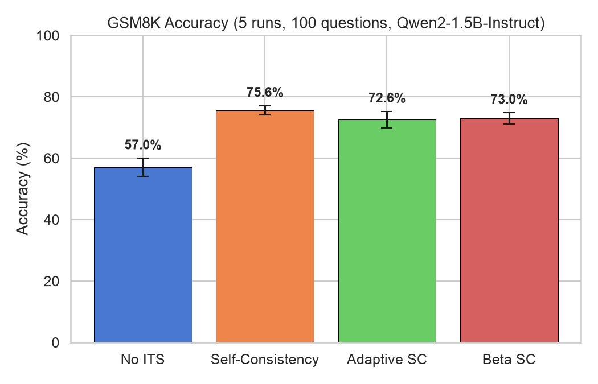
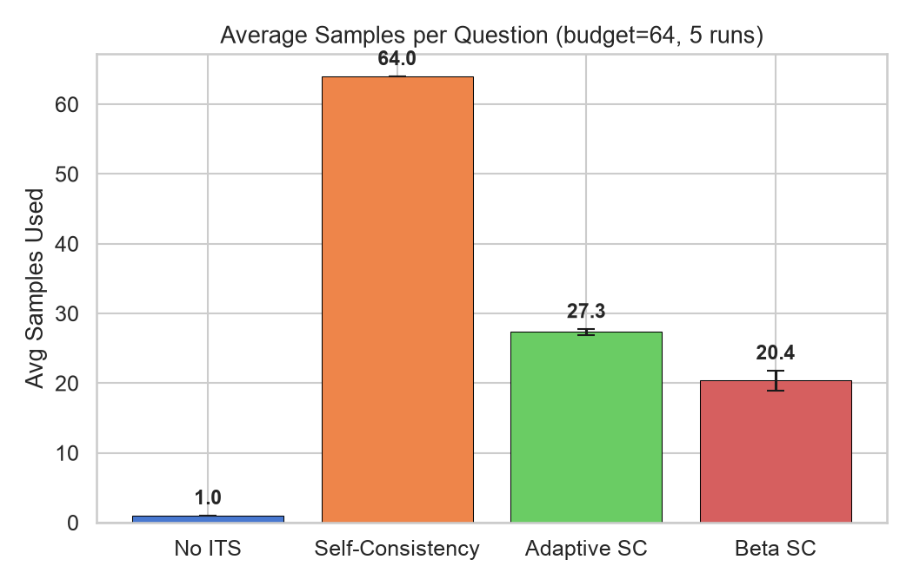
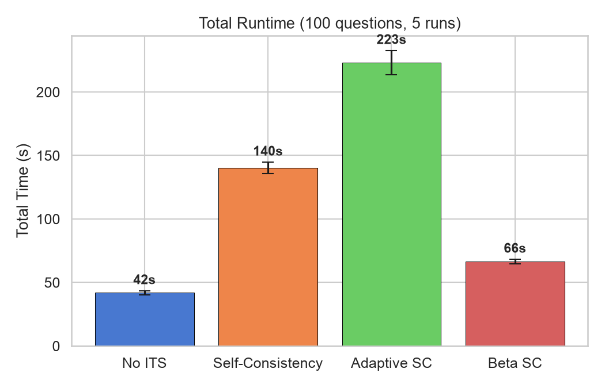

## Algorithms

1.  **No ITS**

2.  **Self-Consistency** (Wang et al., 2022): Generate $N$ independent samples and take the most common answer.

3.  **Adaptive Self-Consistency**: Start with 2 samples, check if a supermajority (75%) agrees. If not, iteratively double the batch size up $N$ total samples.

4.  **Beta Self-Consistency** (Aggarwal et al., 2023), implemented efficiently: Fire all $N$ requests concurrently and process responses as they arrive. After each response arrives, compute the probability $P$ that the current most common answer is more common than the second most common answer. Cancel all of the pending requests as soon as $P \geq 0.95$. 

    

## Experiment

- **Model**: Qwen2-1.5B-Instruct
- **Benchmark**: GSM8K (first 100 questions)
- **Budget**: 64 samples/question
- **Temperature**: 0.7
- **Serving**: vLLM on 1x H100, 32 concurrent requests
- **Runs**: 5 per algorithm

